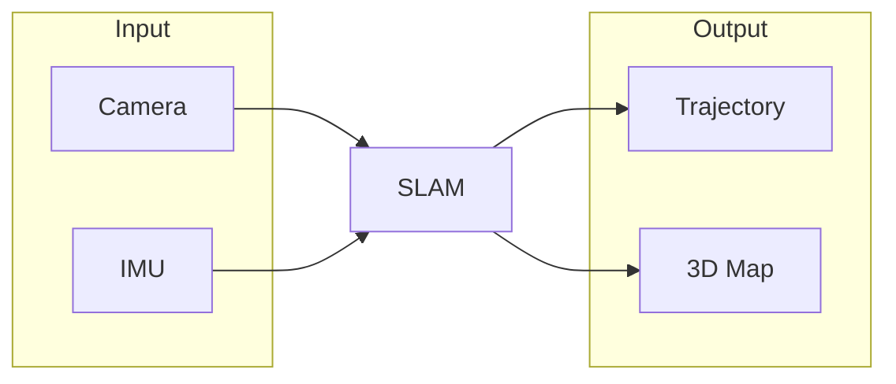
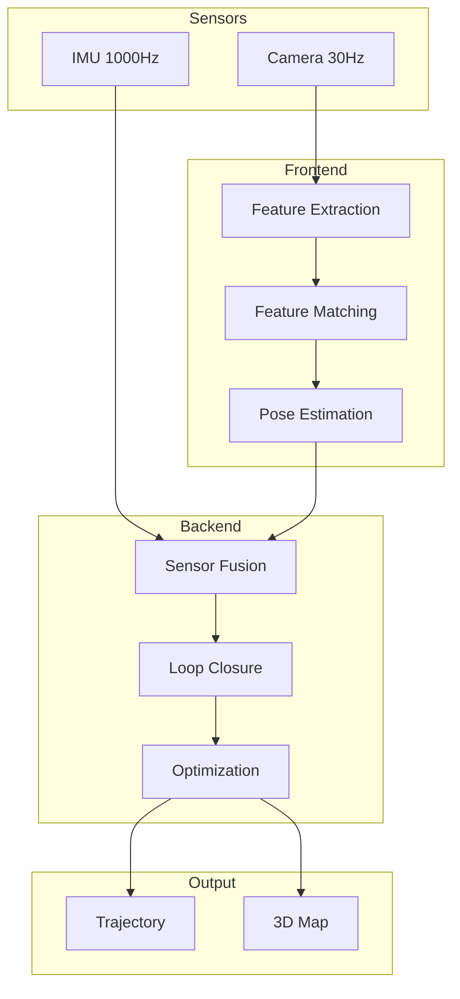
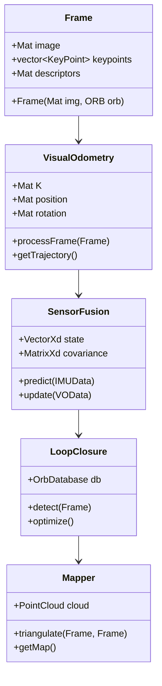
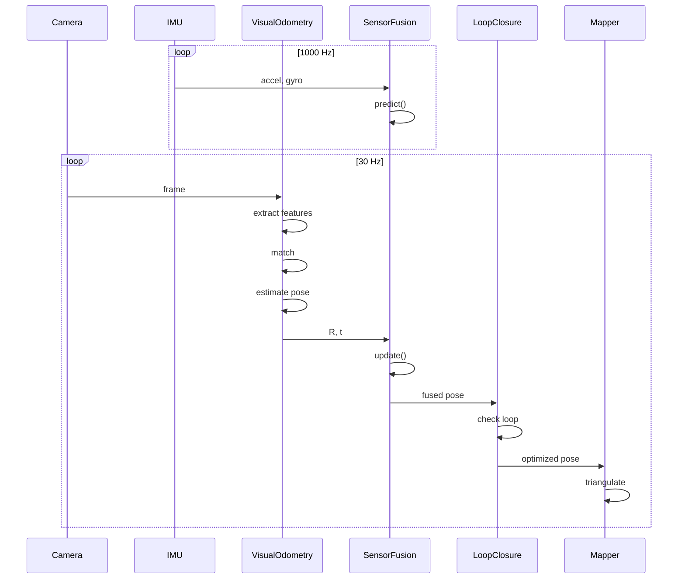
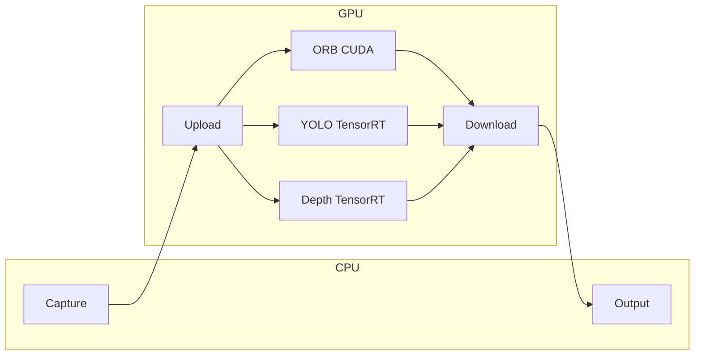
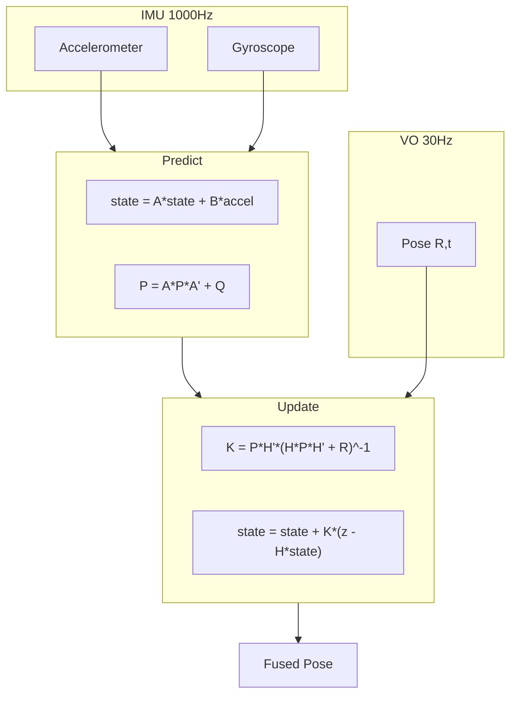
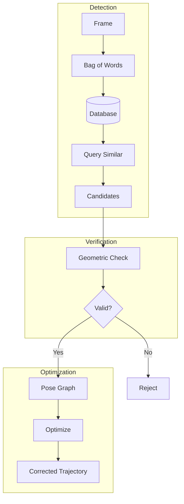
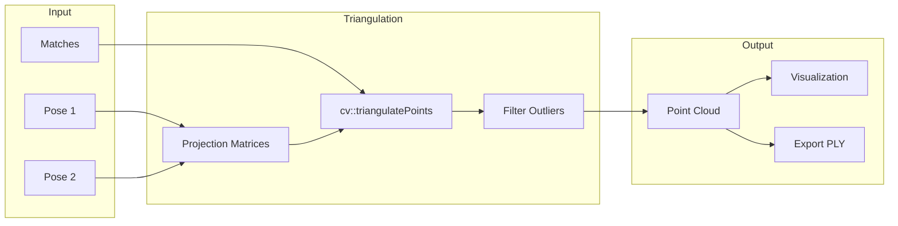

# Aria SLAM

Visual SLAM system in C++ with GPU acceleration (CUDA/TensorRT) for real-time autonomous navigation. Modular implementation including Visual Odometry, feature matching, pose estimation, and deep learning inference support.

---

## Table of Contents

1. [Introduction](#introduction)
2. [Visual SLAM Explained](#visual-slam-explained)
3. [System Architecture](#system-architecture)
4. [Processing Pipeline](#processing-pipeline)
5. [Project Milestones](#project-milestones)
6. [Code Structure](#code-structure)
7. [Dependencies](#dependencies)
8. [Build & Run](#build--run)
9. [References](#references)

---

## Introduction

### What is this project?

Aria SLAM is a from-scratch implementation of a complete SLAM system in C++. The system processes video streams and IMU sensor data to:

- Calculate camera position and orientation in real-time
- Build a 3D map of the environment
- Detect when returning to a previously visited location (loop closure)
- Run deep learning models for detection and depth estimation

### What is it for?

GPS-free autonomous navigation. Drones, robots, AR/VR devices need to know where they are using only their sensors. SLAM analyzes what the camera sees and IMU data to deduce position and build maps.

### Why C++ with CUDA/TensorRT?

Real-time navigation systems require maximum performance. This project demonstrates proficiency in:

- C++ for embedded systems
- CUDA for GPU processing
- TensorRT for deep learning inference
- Sensor fusion for robustness
- Production SLAM architectures

---

## Visual SLAM Explained

### The Problem

Given a sequence of images and IMU data, we want to:
1. Calculate camera position at each instant
2. Build a 3D map of the environment
3. Correct accumulated errors (drift)


```mermaid
flowchart LR
    subgraph Input
        C[Camera]
        I[IMU]
    end

    subgraph Output
        T[Trajectory]
        M[3D Map]
    end

    C --> SLAM
    I --> SLAM
    SLAM --> T
    SLAM --> M
```

### The Solution (Complete Pipeline)


```mermaid
flowchart TD
    subgraph Sensors["Sensors"]
        CAM[Camera 30Hz]
        IMU[IMU 1000Hz]
    end

    subgraph Frontend["Frontend"]
        FE[Feature Extraction]
        FM[Feature Matching]
        PE[Pose Estimation]
    end

    subgraph Backend["Backend"]
        SF[Sensor Fusion]
        LC[Loop Closure]
        OPT[Optimization]
    end

    subgraph Output["Output"]
        TRAJ[Trajectory]
        MAP[3D Map]
    end

    CAM --> FE --> FM --> PE
    IMU --> SF
    PE --> SF
    SF --> LC
    LC --> OPT
    OPT --> TRAJ
    OPT --> MAP
```

### Key Components

**1. Feature Extraction (ORB)**
- Detects distinctive points in the image
- Generates descriptors (fingerprint) per point

**2. Feature Matching**
- Finds correspondences between frames
- Ratio test filters false positives

**3. Pose Estimation**
- Essential Matrix relates 2 views
- Recover Pose extracts rotation and translation

**4. Sensor Fusion (Kalman Filter)**
- IMU predicts pose at 1000 Hz
- VO corrects drift at 30 Hz

**5. Loop Closure (DBoW2)**
- Detects revisited places
- Bag of Words compares frames

**6. Mapping (Triangulation)**
- Converts 2D matches to 3D points
- Generates point cloud of the environment

---

## System Architecture

### General Diagram


```mermaid
flowchart TD
    subgraph Hardware["Hardware"]
        ARIA[Aria Glasses]
        GPU[RTX 2060]
    end

    subgraph Capture["Capture"]
        RGB[RGB Camera]
        SLAM_CAM[SLAM Cameras x2]
        IMU_S[IMU Sensor]
    end

    subgraph Processing["Processing"]
        CUDA[OpenCV CUDA]
        TRT[TensorRT]
        CPU[CPU Pipeline]
    end

    subgraph SLAM["SLAM"]
        VO[Visual Odometry]
        FUSION[Sensor Fusion]
        LOOP[Loop Closure]
        MAPPING[3D Mapping]
    end

    subgraph Output["Output"]
        TRAJ[Trajectory]
        MAP[Point Cloud]
        DET[Detections]
    end

    ARIA --> RGB
    ARIA --> SLAM_CAM
    ARIA --> IMU_S

    RGB --> CUDA
    CUDA --> VO
    IMU_S --> FUSION
    VO --> FUSION
    FUSION --> LOOP
    LOOP --> MAPPING

    CUDA --> TRT
    TRT --> DET

    MAPPING --> MAP
    FUSION --> TRAJ
```

### Class Diagram


```mermaid
classDiagram
    class Frame {
        +Mat image
        +vector~KeyPoint~ keypoints
        +Mat descriptors
        +Frame(Mat img, ORB orb)
    }

    class VisualOdometry {
        +Mat K
        +Mat position
        +Mat rotation
        +processFrame(Frame)
        +getTrajectory()
    }

    class SensorFusion {
        +VectorXd state
        +MatrixXd covariance
        +predict(IMUData)
        +update(VOData)
    }

    class LoopClosure {
        +OrbDatabase db
        +detect(Frame)
        +optimize()
    }

    class Mapper {
        +PointCloud cloud
        +triangulate(Frame, Frame)
        +getMap()
    }

    Frame --> VisualOdometry
    VisualOdometry --> SensorFusion
    SensorFusion --> LoopClosure
    LoopClosure --> Mapper
```

### Data Flow


```mermaid
sequenceDiagram
    participant C as Camera
    participant I as IMU
    participant VO as VisualOdometry
    participant SF as SensorFusion
    participant LC as LoopClosure
    participant M as Mapper

    loop 1000 Hz
        I->>SF: accel, gyro
        SF->>SF: predict()
    end

    loop 30 Hz
        C->>VO: frame
        VO->>VO: extract features
        VO->>VO: match
        VO->>VO: estimate pose
        VO->>SF: R, t
        SF->>SF: update()
        SF->>LC: fused pose
        LC->>LC: check loop
        LC->>M: optimized pose
        M->>M: triangulate
    end
```

---

## Processing Pipeline

### GPU Pipeline (H5-H6)


```mermaid
flowchart LR
    subgraph CPU
        CAP[Capture]
        OUT[Output]
    end

    subgraph GPU
        UP[Upload]
        ORB[ORB CUDA]
        YOLO[YOLO TensorRT]
        DEPTH[Depth TensorRT]
        DOWN[Download]
    end

    CAP --> UP
    UP --> ORB --> DOWN
    UP --> YOLO --> DOWN
    UP --> DEPTH --> DOWN
    DOWN --> OUT
```

### Sensor Fusion Pipeline (H8)


```mermaid
flowchart TD
    subgraph IMU["IMU 1000Hz"]
        ACC[Accelerometer]
        GYRO[Gyroscope]
    end

    subgraph Predict
        A["state = A*state + B*accel"]
        B["P = A*P*A' + Q"]
    end

    subgraph VO["VO 30Hz"]
        POSE[Pose R,t]
    end

    subgraph Update
        C["K = P*H'*(H*P*H' + R)^-1"]
        D["state = state + K*(z - H*state)"]
    end

    ACC --> Predict
    GYRO --> Predict
    Predict --> Update
    POSE --> Update
    Update --> OUTPUT[Fused Pose]
```

### Loop Closure Pipeline (H9)


```mermaid
flowchart TD
    subgraph Detection
        F[Frame] --> BOW[Bag of Words]
        BOW --> DB[(Database)]
        DB --> QUERY[Query Similar]
        QUERY --> CAND[Candidates]
    end

    subgraph Verification
        CAND --> GEOM[Geometric Check]
        GEOM --> VALID{Valid?}
    end

    subgraph Optimization
        VALID -->|Yes| GRAPH[Pose Graph]
        GRAPH --> OPT[Optimize]
        OPT --> CORRECT[Corrected Trajectory]
    end

    VALID -->|No| REJECT[Reject]
```

### Mapping Pipeline (H10)


```mermaid
flowchart LR
    subgraph Input
        M1[Matches]
        P1[Pose 1]
        P2[Pose 2]
    end

    subgraph Triangulation
        PROJ[Projection Matrices]
        TRI[cv::triangulatePoints]
        FILT[Filter Outliers]
    end

    subgraph Output
        PC[Point Cloud]
        VIS[Visualization]
        EXP[Export PLY]
    end

    M1 --> TRI
    P1 --> PROJ --> TRI
    P2 --> PROJ
    TRI --> FILT --> PC
    PC --> VIS
    PC --> EXP
```

---

## Project Milestones

| Milestone | Name | Description | Status |
|-----------|------|-------------|--------|
| H1 | Setup + Capture | CMake, OpenCV, video input | Done |
| H2 | Feature Extraction | ORB detector, keypoints | Done |
| H3 | Feature Matching | BFMatcher, ratio test | Done |
| H4 | Pose Estimation | Essential matrix, trajectory | Done |
| H5 | OpenCV CUDA | GpuMat, GPU ORB, smart pointers | Done |
| H6 | TensorRT | YOLOv12s object detection | Done |
| H7 | Aria Integration | Aria SDK, sensor capture | Pending |
| H8 | Sensor Fusion | IMU preintegration, Kalman filter | Done |
| H9 | Loop Closure | DBoW2, pose graph | Pending |
| H10 | 3D Mapping | Triangulation, point cloud | Pending |

### Visual Progress


```mermaid
gantt
    title SLAM Progress
    dateFormat X
    axisFormat %s

    section Completed
    H1 Setup           :done, h1, 0, 1
    H2 Features        :done, h2, 1, 2
    H3 Matching        :done, h3, 2, 3
    H4 Pose            :done, h4, 3, 4
    H5 CUDA            :done, h5, 4, 5
    H6 TensorRT        :done, h6, 5, 6
    H8 Fusion          :done, h8, 6, 7

    section Pending
    H7 Aria            :h7, 7, 8
    H9 Loop Closure    :h9, 8, 9
    H10 Mapping        :h10, 9, 10
```

---

## Code Structure

```
aria-slam/
├── CMakeLists.txt
├── README.md
├── include/
│   ├── Frame.hpp          # Frame with keypoints and descriptors
│   ├── TRTInference.hpp   # TensorRT YOLO inference
│   ├── IMU.hpp            # IMU preintegration and sensor fusion
│   └── SyntheticIMU.hpp   # Synthetic IMU for testing
├── src/
│   ├── main.cpp           # Main SLAM pipeline
│   ├── Frame.cpp          # Frame implementation
│   ├── TRTInference.cpp   # TensorRT implementation
│   ├── IMU.cpp            # Sensor fusion implementation
│   └── test_imu.cpp       # IMU fusion test
├── models/
│   └── yolov12s.engine    # YOLOv12s TensorRT engine
├── build/
└── test.mp4
```

---

## Dependencies

### Requirements

| Dependency | Version | Purpose |
|------------|---------|---------|
| CMake | >= 3.16 | Build system |
| GCC/Clang | C++17 | Compiler |
| OpenCV | >= 4.6 + CUDA | Computer vision |
| CUDA Toolkit | >= 12.0 | GPU computing |
| TensorRT | >= 8.0 | Deep learning inference |
| Eigen | >= 3.3 | Linear algebra |
| PCL | >= 1.12 | Point clouds |
| DBoW2 | - | Loop closure |
| g2o | - | Graph optimization |

### Ubuntu Installation

```bash
# Basics
sudo apt update
sudo apt install cmake g++ gcc-12 g++-12 libopencv-dev

# CUDA Toolkit (use /home as tmp if / is full)
export TMPDIR=/home/$USER/tmp && mkdir -p $TMPDIR
sudo apt install nvidia-cuda-toolkit

# Eigen
sudo apt install libeigen3-dev

# PCL
sudo apt install libpcl-dev
```

### OpenCV with CUDA (Compilation)

OpenCV from apt doesn't include CUDA support. Must be compiled:

```bash
# Clone OpenCV 4.9.0
cd ~/libs
git clone --depth 1 --branch 4.9.0 https://github.com/opencv/opencv.git
git clone --depth 1 --branch 4.9.0 https://github.com/opencv/opencv_contrib.git

# Configure (use GCC-12 for CUDA compatibility)
mkdir -p opencv/build && cd opencv/build
cmake .. \
    -DCMAKE_C_COMPILER=/usr/bin/gcc-12 \
    -DCMAKE_CXX_COMPILER=/usr/bin/g++-12 \
    -DCMAKE_BUILD_TYPE=Release \
    -DCMAKE_INSTALL_PREFIX=~/libs/opencv_cuda \
    -DWITH_CUDA=ON \
    -DWITH_CUDNN=OFF \
    -DENABLE_FAST_MATH=ON \
    -DCUDA_FAST_MATH=ON \
    -DWITH_CUBLAS=ON \
    -DCUDA_ARCH_BIN=7.5 \
    -DOPENCV_EXTRA_MODULES_PATH=~/libs/opencv_contrib/modules \
    -DBUILD_EXAMPLES=OFF \
    -DBUILD_TESTS=OFF

# Compile and install (~20-30 min)
make -j8 && make install

# Add to ~/.zshrc or ~/.bashrc
export OpenCV_DIR=~/libs/opencv_cuda
```

> **Note:** Change `CUDA_ARCH_BIN=7.5` according to your GPU:
> - RTX 2060/2070/2080: 7.5
> - RTX 3060/3070/3080: 8.6
> - RTX 4060/4070/4080: 8.9
> - RTX 5070/5080/5090: 10.0

### TensorRT (Installation)

```bash
# Download TensorRT 10.x from NVIDIA (requires account)
# https://developer.nvidia.com/tensorrt/download

# Extract
cd ~/libs
tar -xzf TensorRT-10.7.0.23.Linux.x86_64-gnu.cuda-12.6.tar.gz

# Add to ~/.zshrc or ~/.bashrc
export LD_LIBRARY_PATH=~/libs/TensorRT-10.7.0.23/lib:$LD_LIBRARY_PATH
export PATH=~/libs/TensorRT-10.7.0.23/bin:$PATH

# Convert YOLO model to TensorRT engine
trtexec --onnx=models/yolov12s.onnx --saveEngine=models/yolov12s.engine --fp16
```

### Verify Installation

```bash
nvcc --version          # CUDA compiler
nvidia-smi              # GPU status
pkg-config --modversion opencv4
pkg-config --modversion eigen3
```

---

## Build & Run

### Compile

```bash
mkdir -p build && cd build
cmake ..
make -j$(nproc)
```

### Run

```bash
./aria_slam
```

### SSH with X11

```bash
ssh -Y user@host
export LIBGL_ALWAYS_SOFTWARE=1
./aria_slam
```

---

## References

### Papers
- [ORB-SLAM2](https://arxiv.org/abs/1610.06475)
- [VINS-Mono](https://arxiv.org/abs/1708.03852)
- [DBoW2](https://github.com/dorian3d/DBoW2)

### Documentation
- [OpenCV CUDA](https://docs.opencv.org/4.x/d2/dbc/cuda_intro.html)
- [TensorRT Developer Guide](https://docs.nvidia.com/deeplearning/tensorrt/developer-guide/)
- [Eigen Quick Reference](https://eigen.tuxfamily.org/dox/group__QuickRefPage.html)
- [PCL Tutorials](https://pcl.readthedocs.io/)

### Resources
- [Meta Aria Project](https://www.projectaria.com/)
- [Multiple View Geometry Book](https://www.robots.ox.ac.uk/~vgg/hzbook/)

---

## Author

Developed as a learning project for C++, CUDA, and SLAM systems.

## License

MIT
