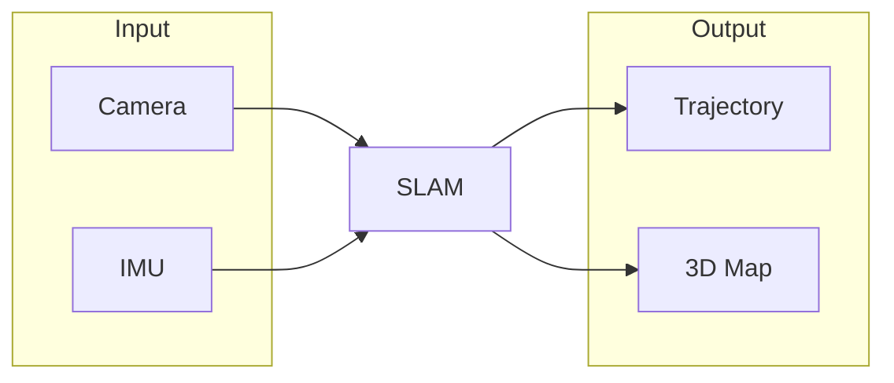
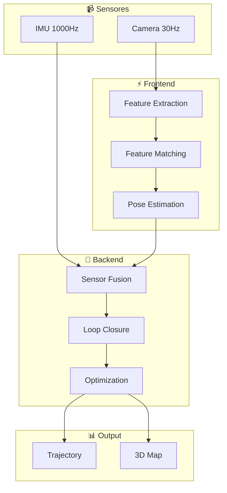
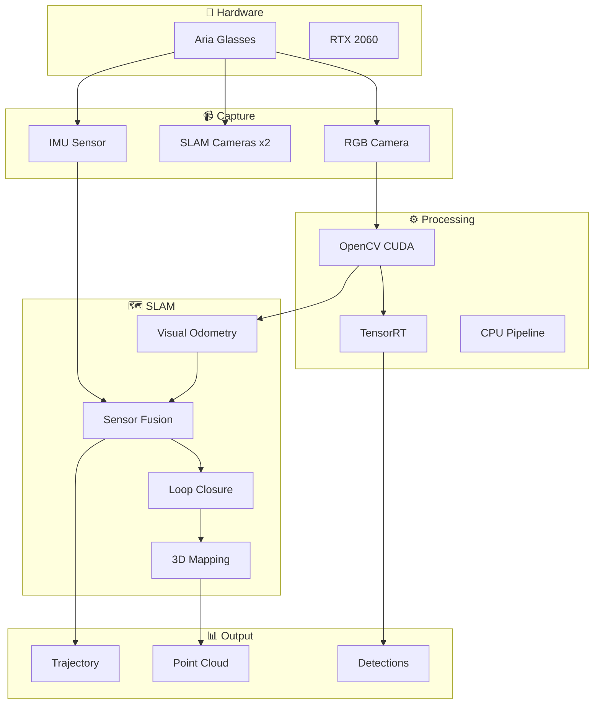
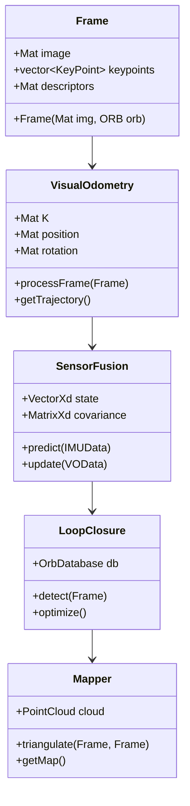
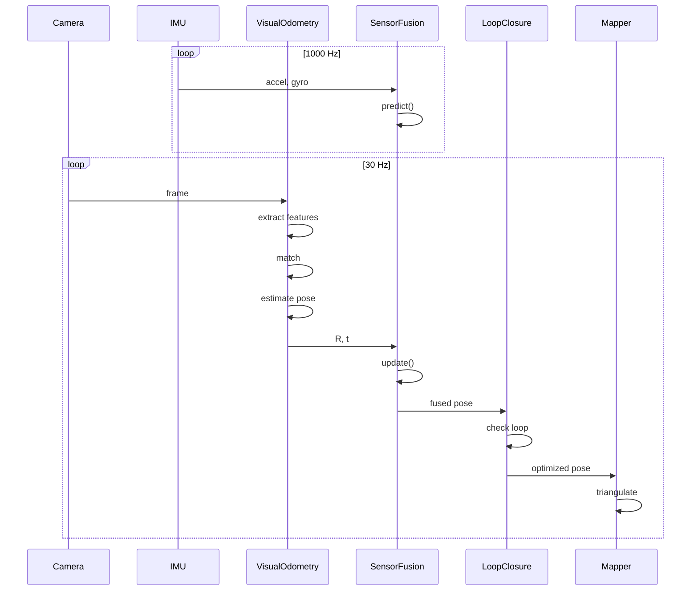
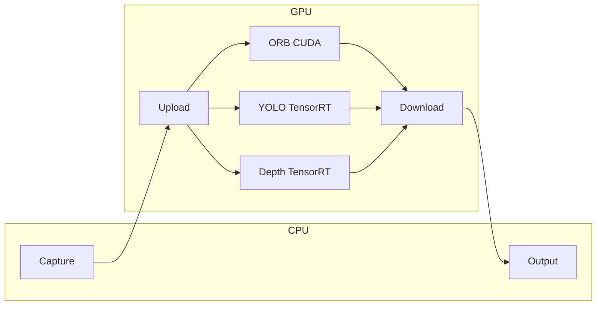
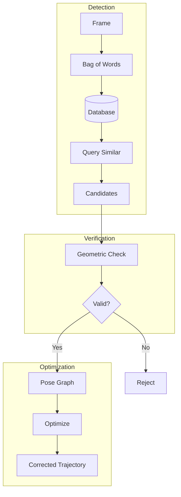
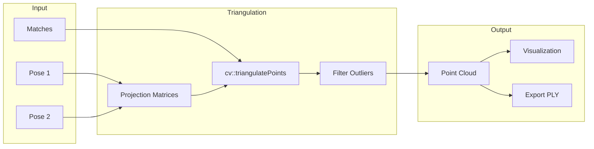

# Aria SLAM

Sistema de Visual SLAM en C++ con aceleración GPU (CUDA/TensorRT) para navegación autónoma en tiempo real. Implementación modular que incluye Visual Odometry, feature matching, pose estimation y soporte para deep learning inference.

---

## Índice

1. [Introducción](#introducción)
2. [Visual SLAM Explicado](#visual-slam-explicado)
3. [Arquitectura del Sistema](#arquitectura-del-sistema)
4. [Pipeline de Procesamiento](#pipeline-de-procesamiento)
5. [Hitos del Proyecto](#hitos-del-proyecto)
6. [Estructura del Código](#estructura-del-código)
7. [Dependencias](#dependencias)
8. [Build & Run](#build--run)
9. [Referencias](#referencias)

---

## Introducción

### ¿Qué es este proyecto?

Aria SLAM es una implementación desde cero de un sistema SLAM completo en C++. El sistema procesa streams de video y sensores IMU para:

- Calcular la posición y orientación de la cámara en tiempo real
- Construir un mapa 3D del entorno
- Detectar cuando vuelves a un lugar visitado (loop closure)
- Ejecutar modelos de deep learning para detección y depth estimation

### ¿Para qué sirve?

Navegación autónoma sin GPS. Drones, robots, dispositivos AR/VR necesitan saber dónde están usando solo sus sensores. SLAM analiza lo que ve la cámara y los datos del IMU para deducir posición y construir mapas.

### ¿Por qué C++ con CUDA/TensorRT?

Los sistemas de navegación en tiempo real requieren máximo rendimiento. Este proyecto demuestra competencia en:

- C++ para sistemas embebidos
- CUDA para procesamiento GPU
- TensorRT para inference de deep learning
- Sensor fusion para robustez
- Arquitecturas SLAM de producción

---

## Visual SLAM Explicado

### El Problema

Dada una secuencia de imágenes y datos IMU, queremos:
1. Calcular la posición de la cámara en cada instante
2. Construir un mapa 3D del entorno
3. Corregir errores acumulados (drift)


```mermaid
flowchart LR
    subgraph Input
        C[Camera]
        I[IMU]
    end
    
    subgraph Output
        T[Trajectory]
        M[3D Map]
    end
    
    C --> SLAM
    I --> SLAM
    SLAM --> T
    SLAM --> M
```

### La Solución (Pipeline Completo)


```mermaid
flowchart TD
    subgraph Sensores["📹 Sensores"]
        CAM[Camera 30Hz]
        IMU[IMU 1000Hz]
    end
    
    subgraph Frontend["⚡ Frontend"]
        FE[Feature Extraction]
        FM[Feature Matching]
        PE[Pose Estimation]
    end
    
    subgraph Backend["🧠 Backend"]
        SF[Sensor Fusion]
        LC[Loop Closure]
        OPT[Optimization]
    end
    
    subgraph Output["📊 Output"]
        TRAJ[Trajectory]
        MAP[3D Map]
    end
    
    CAM --> FE --> FM --> PE
    IMU --> SF
    PE --> SF
    SF --> LC
    LC --> OPT
    OPT --> TRAJ
    OPT --> MAP
```

### Componentes Clave

**1. Feature Extraction (ORB)**
- Detecta puntos distintivos en la imagen
- Genera descriptores (huella digital) por punto

**2. Feature Matching**
- Encuentra correspondencias entre frames
- Ratio test filtra falsos positivos

**3. Pose Estimation**
- Essential Matrix relaciona 2 vistas
- Recover Pose extrae rotación y traslación

**4. Sensor Fusion (Kalman Filter)**
- IMU predice pose a 1000 Hz
- VO corrige drift a 30 Hz

**5. Loop Closure (DBoW2)**
- Detecta lugares revisitados
- Bag of Words compara frames

**6. Mapping (Triangulación)**
- Convierte matches 2D a puntos 3D
- Genera nube de puntos del entorno

---

## Arquitectura del Sistema

### Diagrama General


```mermaid
flowchart TD
    subgraph Hardware["🔧 Hardware"]
        ARIA[Aria Glasses]
        GPU[RTX 2060]
    end
    
    subgraph Capture["📹 Capture"]
        RGB[RGB Camera]
        SLAM_CAM[SLAM Cameras x2]
        IMU_S[IMU Sensor]
    end
    
    subgraph Processing["⚙️ Processing"]
        CUDA[OpenCV CUDA]
        TRT[TensorRT]
        CPU[CPU Pipeline]
    end
    
    subgraph SLAM["🗺️ SLAM"]
        VO[Visual Odometry]
        FUSION[Sensor Fusion]
        LOOP[Loop Closure]
        MAPPING[3D Mapping]
    end
    
    subgraph Output["📊 Output"]
        TRAJ[Trajectory]
        MAP[Point Cloud]
        DET[Detections]
    end
    
    ARIA --> RGB
    ARIA --> SLAM_CAM
    ARIA --> IMU_S
    
    RGB --> CUDA
    CUDA --> VO
    IMU_S --> FUSION
    VO --> FUSION
    FUSION --> LOOP
    LOOP --> MAPPING
    
    CUDA --> TRT
    TRT --> DET
    
    MAPPING --> MAP
    FUSION --> TRAJ
```

### Diagrama de Clases


```mermaid
classDiagram
    class Frame {
        +Mat image
        +vector~KeyPoint~ keypoints
        +Mat descriptors
        +Frame(Mat img, ORB orb)
    }
    
    class VisualOdometry {
        +Mat K
        +Mat position
        +Mat rotation
        +processFrame(Frame)
        +getTrajectory()
    }
    
    class SensorFusion {
        +VectorXd state
        +MatrixXd covariance
        +predict(IMUData)
        +update(VOData)
    }
    
    class LoopClosure {
        +OrbDatabase db
        +detect(Frame)
        +optimize()
    }
    
    class Mapper {
        +PointCloud cloud
        +triangulate(Frame, Frame)
        +getMap()
    }
    
    Frame --> VisualOdometry
    VisualOdometry --> SensorFusion
    SensorFusion --> LoopClosure
    LoopClosure --> Mapper
```

### Flujo de Datos


```mermaid
sequenceDiagram
    participant C as Camera
    participant I as IMU
    participant VO as VisualOdometry
    participant SF as SensorFusion
    participant LC as LoopClosure
    participant M as Mapper
    
    loop 1000 Hz
        I->>SF: accel, gyro
        SF->>SF: predict()
    end
    
    loop 30 Hz
        C->>VO: frame
        VO->>VO: extract features
        VO->>VO: match
        VO->>VO: estimate pose
        VO->>SF: R, t
        SF->>SF: update()
        SF->>LC: fused pose
        LC->>LC: check loop
        LC->>M: optimized pose
        M->>M: triangulate
    end
```

---

## Pipeline de Procesamiento

### Pipeline GPU (H5-H6)


```mermaid
flowchart LR
    subgraph CPU
        CAP[Capture]
        OUT[Output]
    end
    
    subgraph GPU
        UP[Upload]
        ORB[ORB CUDA]
        YOLO[YOLO TensorRT]
        DEPTH[Depth TensorRT]
        DOWN[Download]
    end
    
    CAP --> UP
    UP --> ORB --> DOWN
    UP --> YOLO --> DOWN
    UP --> DEPTH --> DOWN
    DOWN --> OUT
```

### Pipeline Sensor Fusion (H8)


```mermaid
flowchart TD
    subgraph IMU["IMU 1000Hz"]
        ACC[Accelerometer]
        GYRO[Gyroscope]
    end
    
    subgraph Predict
        A["state = A·state + B·accel"]
        B["P = A·P·Aᵀ + Q"]
    end
    
    subgraph VO["VO 30Hz"]
        POSE[Pose R,t]
    end
    
    subgraph Update
        C["K = P·Hᵀ·(H·P·Hᵀ + R)⁻¹"]
        D["state = state + K·(z - H·state)"]
    end
    
    ACC --> Predict
    GYRO --> Predict
    Predict --> Update
    POSE --> Update
    Update --> OUTPUT[Fused Pose]
```

### Pipeline Loop Closure (H9)


```mermaid
flowchart TD
    subgraph Detection
        F[Frame] --> BOW[Bag of Words]
        BOW --> DB[(Database)]
        DB --> QUERY[Query Similar]
        QUERY --> CAND[Candidates]
    end
    
    subgraph Verification
        CAND --> GEOM[Geometric Check]
        GEOM --> VALID{Valid?}
    end
    
    subgraph Optimization
        VALID -->|Yes| GRAPH[Pose Graph]
        GRAPH --> OPT[Optimize]
        OPT --> CORRECT[Corrected Trajectory]
    end
    
    VALID -->|No| REJECT[Reject]
```

### Pipeline Mapping (H10)


```mermaid
flowchart LR
    subgraph Input
        M1[Matches]
        P1[Pose 1]
        P2[Pose 2]
    end
    
    subgraph Triangulation
        PROJ[Projection Matrices]
        TRI[cv::triangulatePoints]
        FILT[Filter Outliers]
    end
    
    subgraph Output
        PC[Point Cloud]
        VIS[Visualization]
        EXP[Export PLY]
    end
    
    M1 --> TRI
    P1 --> PROJ --> TRI
    P2 --> PROJ
    TRI --> FILT --> PC
    PC --> VIS
    PC --> EXP
```

---

## Hitos del Proyecto

| Hito | Nombre | Descripción | Estado |
|------|--------|-------------|--------|
| H1 | Setup + Captura | CMake, OpenCV, video input | ✅ |
| H2 | Feature Extraction | ORB detector, keypoints | ✅ |
| H3 | Feature Matching | BFMatcher, ratio test | ✅ |
| H4 | Pose Estimation | Essential matrix, trajectory | ✅ |
| H5 | OpenCV CUDA | GpuMat, ORB GPU | 🔄 |
| H6 | TensorRT | YOLO, depth inference | ⏳ |
| H7 | Aria Integration | Aria SDK, sensor capture | ⏳ |
| H8 | Sensor Fusion | IMU + VO, Kalman filter | ⏳ |
| H9 | Loop Closure | DBoW2, pose graph | ⏳ |
| H10 | Mapping 3D | Triangulation, point cloud | ⏳ |

### Progreso Visual


```mermaid
gantt
    title Progreso SLAM
    dateFormat X
    axisFormat %s
    
    section Completado
    H1 Setup           :done, h1, 0, 1
    H2 Features        :done, h2, 1, 2
    H3 Matching        :done, h3, 2, 3
    H4 Pose            :done, h4, 3, 4
    
    section En Progreso
    H5 CUDA            :active, h5, 4, 5
    
    section Pendiente
    H6 TensorRT        :h6, 5, 6
    H7 Aria            :h7, 6, 7
    H8 Fusion          :h8, 7, 8
    H9 Loop Closure    :h9, 8, 9
    H10 Mapping        :h10, 9, 10
```

---

## Estructura del Código

```
aria-slam/
├── 📄 CMakeLists.txt
├── 📄 README.md
├── 📁 include/
│   ├── 📄 Frame.hpp
│   ├── 📄 VisualOdometry.hpp
│   ├── 📄 SensorFusion.hpp
│   ├── 📄 LoopClosure.hpp
│   └── 📄 Mapper.hpp
├── 📁 src/
│   ├── 📄 main.cpp
│   ├── 📄 Frame.cpp
│   ├── 📄 VisualOdometry.cpp
│   ├── 📄 SensorFusion.cpp
│   ├── 📄 LoopClosure.cpp
│   └── 📄 Mapper.cpp
├── 📁 models/
│   ├── 📄 yolo.engine
│   └── 📄 depth.engine
├── 📁 vocab/
│   └── 📄 orb_vocab.txt
├── 📁 build/
└── 🎬 test.mp4
```

---

## Dependencias

### Requisitos

| Dependencia | Versión | Propósito |
|-------------|---------|-----------|
| CMake | ≥ 3.16 | Build system |
| GCC/Clang | C++17 | Compilador |
| OpenCV | ≥ 4.6 + CUDA | Computer vision |
| CUDA Toolkit | ≥ 12.0 | GPU computing |
| TensorRT | ≥ 8.0 | Deep learning inference |
| Eigen | ≥ 3.3 | Álgebra lineal |
| PCL | ≥ 1.12 | Point clouds |
| DBoW2 | - | Loop closure |
| g2o | - | Graph optimization |

### Instalación Ubuntu

```bash
# Básicos
sudo apt update
sudo apt install cmake g++ gcc-12 g++-12 libopencv-dev

# CUDA Toolkit (usar /home como tmp si / está lleno)
export TMPDIR=/home/$USER/tmp && mkdir -p $TMPDIR
sudo apt install nvidia-cuda-toolkit

# Eigen
sudo apt install libeigen3-dev

# PCL
sudo apt install libpcl-dev
```

### OpenCV con CUDA (Compilación)

OpenCV de apt no incluye soporte CUDA. Hay que compilarlo:

```bash
# Clonar OpenCV 4.9.0
cd ~/libs
git clone --depth 1 --branch 4.9.0 https://github.com/opencv/opencv.git
git clone --depth 1 --branch 4.9.0 https://github.com/opencv/opencv_contrib.git

# Configurar (usar GCC-12 para compatibilidad con CUDA)
mkdir -p opencv/build && cd opencv/build
cmake .. \
    -DCMAKE_C_COMPILER=/usr/bin/gcc-12 \
    -DCMAKE_CXX_COMPILER=/usr/bin/g++-12 \
    -DCMAKE_BUILD_TYPE=Release \
    -DCMAKE_INSTALL_PREFIX=~/libs/opencv_cuda \
    -DWITH_CUDA=ON \
    -DWITH_CUDNN=OFF \
    -DENABLE_FAST_MATH=ON \
    -DCUDA_FAST_MATH=ON \
    -DWITH_CUBLAS=ON \
    -DCUDA_ARCH_BIN=7.5 \
    -DOPENCV_EXTRA_MODULES_PATH=~/libs/opencv_contrib/modules \
    -DBUILD_EXAMPLES=OFF \
    -DBUILD_TESTS=OFF

# Compilar e instalar (~20-30 min)
make -j8 && make install

# Añadir a ~/.zshrc o ~/.bashrc
export OpenCV_DIR=~/libs/opencv_cuda
```

> **Nota:** Cambiar `CUDA_ARCH_BIN=7.5` según tu GPU:
> - RTX 2060/2070/2080: 7.5
> - RTX 3060/3070/3080: 8.6
> - RTX 4060/4070/4080: 8.9
> - RTX 5070/5080/5090: 10.0

### TensorRT (Instalación)

```bash
# Descargar desde NVIDIA (requiere cuenta)
# https://developer.nvidia.com/tensorrt

# Extraer
cd ~/libs
tar -xzf TensorRT-8.6.1.6.Linux.x86_64-gnu.cuda-12.0.tar.gz

# Añadir a ~/.zshrc o ~/.bashrc
export LD_LIBRARY_PATH=~/libs/TensorRT-8.6.1.6/lib:$LD_LIBRARY_PATH
export PATH=~/libs/TensorRT-8.6.1.6/bin:$PATH
```

### Verificar Instalación

```bash
nvcc --version          # CUDA compiler
nvidia-smi              # GPU status
pkg-config --modversion opencv4
pkg-config --modversion eigen3
```

---

## Build & Run

### Compilar

```bash
mkdir -p build && cd build
cmake ..
make -j$(nproc)
```

### Ejecutar

```bash
./aria_slam
```

### SSH con X11

```bash
ssh -Y user@host
export LIBGL_ALWAYS_SOFTWARE=1
./aria_slam
```

---

## Referencias

### Papers
- [ORB-SLAM2](https://arxiv.org/abs/1610.06475)
- [VINS-Mono](https://arxiv.org/abs/1708.03852)
- [DBoW2](https://github.com/dorian3d/DBoW2)

### Documentación
- [OpenCV CUDA](https://docs.opencv.org/4.x/d2/dbc/cuda_intro.html)
- [TensorRT Developer Guide](https://docs.nvidia.com/deeplearning/tensorrt/developer-guide/)
- [Eigen Quick Reference](https://eigen.tuxfamily.org/dox/group__QuickRefPage.html)
- [PCL Tutorials](https://pcl.readthedocs.io/)

### Recursos
- [Meta Aria Project](https://www.projectaria.com/)
- [Multiple View Geometry Book](https://www.robots.ox.ac.uk/~vgg/hzbook/)

---

## Autor

Desarrollado como proyecto de aprendizaje de C++, CUDA y sistemas SLAM.

## Licencia

MIT