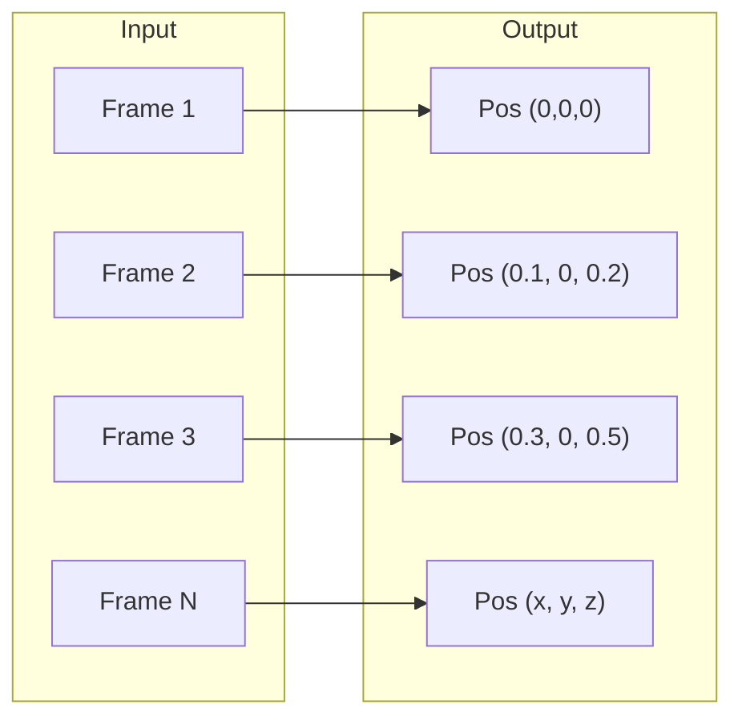
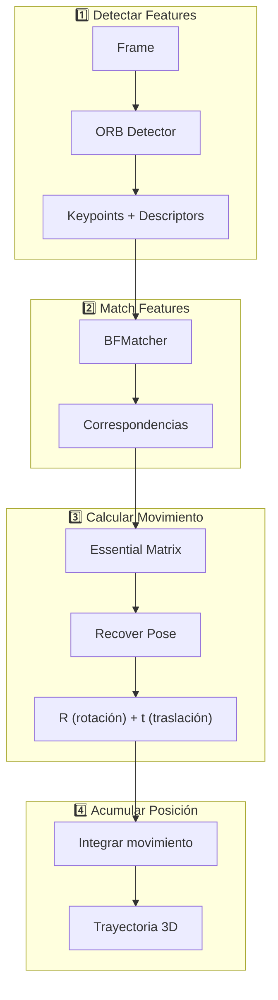
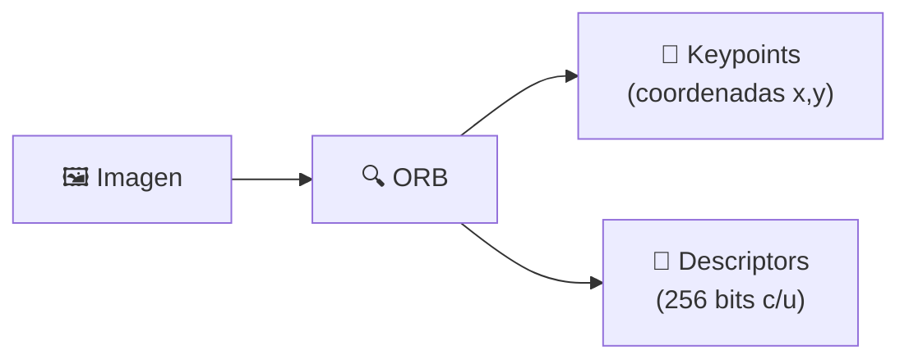
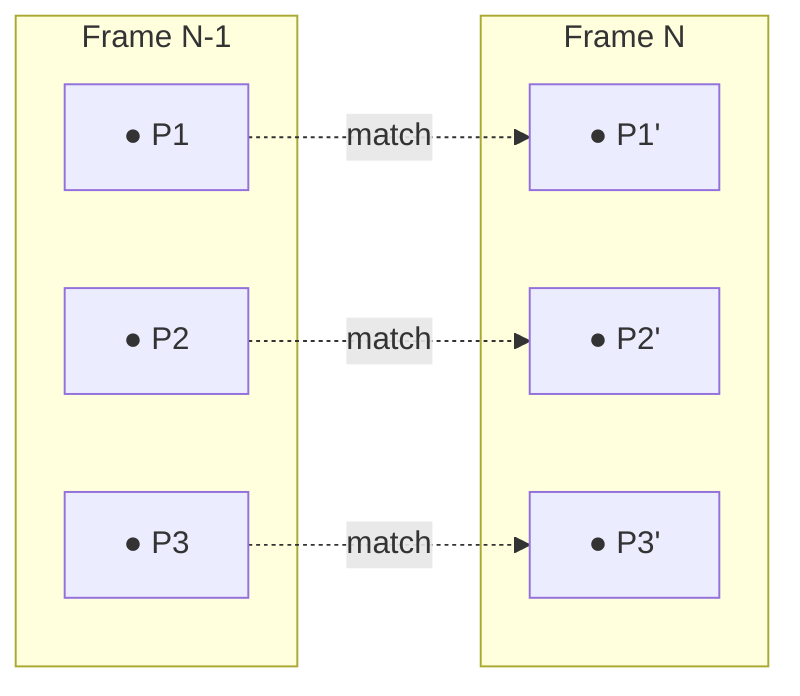
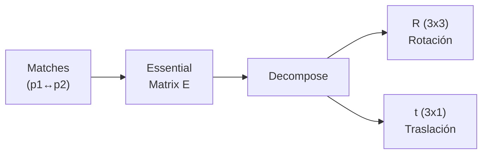
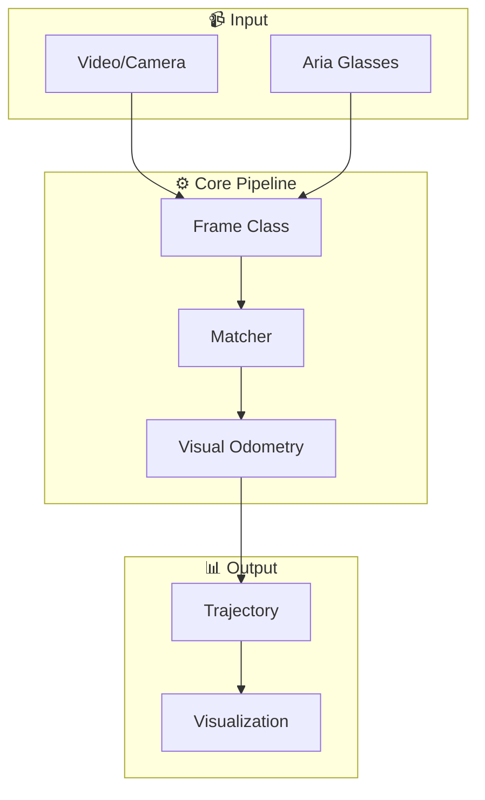
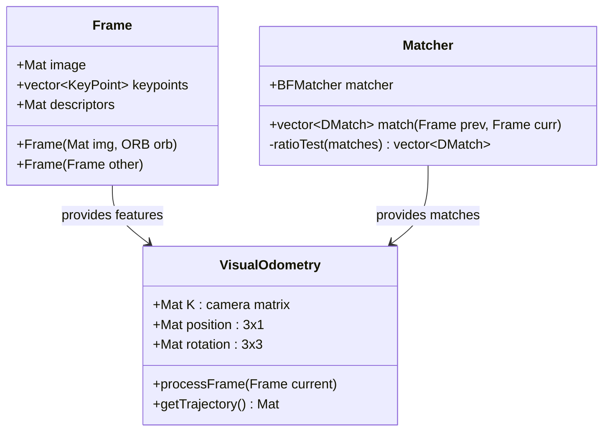
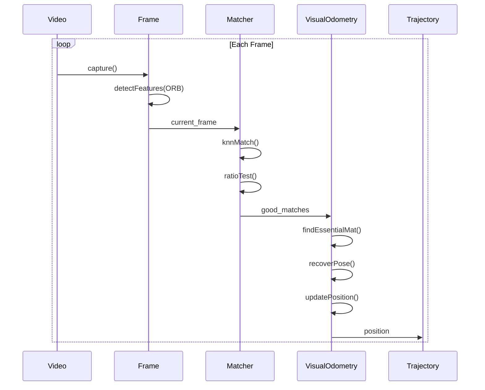
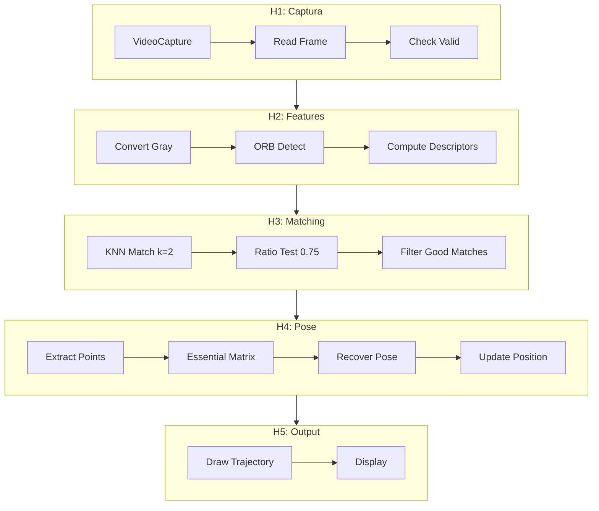
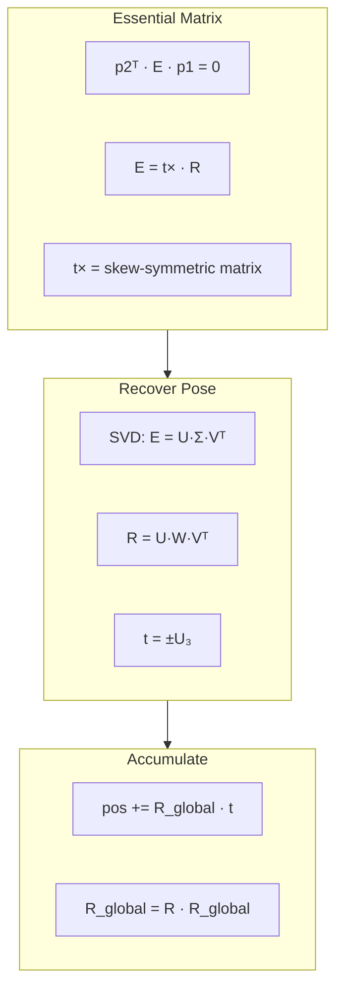

# Aria SLAM - Visual Odometry

Sistema de Visual Odometry en C++ para Meta Aria glasses.

---

## Índice

1. [Introducción](#introducción)
2. [Visual Odometry Explicado](#visual-odometry-explicado)
3. [Arquitectura del Sistema](#arquitectura-del-sistema)
4. [Pipeline de Procesamiento](#pipeline-de-procesamiento)
5. [Hitos del Proyecto](#hitos-del-proyecto)
6. [Estructura del Código](#estructura-del-código)
7. [Dependencias](#dependencias)
8. [Build & Run](#build--run)
9. [Referencias](#referencias)

---

## Introducción

### ¿Qué es este proyecto?

Aria SLAM es una implementación desde cero de Visual Odometry en C++. El sistema procesa un stream de video y calcula en tiempo real cómo se mueve la cámara en el espacio 3D, generando una trayectoria.

### ¿Para qué sirve?

Imagina que tienes unas gafas inteligentes (como Meta Aria) y quieres saber dónde estás sin GPS. Visual Odometry analiza lo que ve la cámara y deduce tu movimiento. Es la base de la navegación autónoma en drones, robots y dispositivos AR/VR.

### ¿Por qué C++?

Los sistemas de visión por computador en tiempo real requieren rendimiento. C++ permite control directo de memoria y optimizaciones que lenguajes como Python no ofrecen. Este proyecto demuestra competencia en C++ para sistemas embebidos y aerospace.

---

## Visual Odometry Explicado

### El Problema

Dada una secuencia de imágenes de una cámara en movimiento, queremos calcular la posición y orientación de la cámara en cada instante.


```mermaid
flowchart LR
    subgraph Input
        F1[Frame 1]
        F2[Frame 2]
        F3[Frame 3]
        FN[Frame N]
    end
    
    subgraph Output
        P1["Pos (0,0,0)"]
        P2["Pos (0.1, 0, 0.2)"]
        P3["Pos (0.3, 0, 0.5)"]
        PN["Pos (x, y, z)"]
    end
    
    F1 --> P1
    F2 --> P2
    F3 --> P3
    FN --> PN
```

### La Solución (4 pasos)


```mermaid
flowchart TD
    subgraph Paso1["1️⃣ Detectar Features"]
        A[Frame] --> B[ORB Detector]
        B --> C[Keypoints + Descriptors]
    end
    
    subgraph Paso2["2️⃣ Match Features"]
        C --> D[BFMatcher]
        D --> E[Correspondencias]
    end
    
    subgraph Paso3["3️⃣ Calcular Movimiento"]
        E --> F[Essential Matrix]
        F --> G[Recover Pose]
        G --> H["R (rotación) + t (traslación)"]
    end
    
    subgraph Paso4["4️⃣ Acumular Posición"]
        H --> I[Integrar movimiento]
        I --> J[Trayectoria 3D]
    end
```

### Paso 1: Detectar Features

Un "feature" es un punto distintivo en la imagen - esquinas, bordes, patrones únicos. ORB (Oriented FAST and Rotated BRIEF) detecta estos puntos y genera un "descriptor" (huella digital) para cada uno.


```mermaid
flowchart LR
    A["🖼️ Imagen"] --> B["🔍 ORB"]
    B --> C["📍 Keypoints\n(coordenadas x,y)"]
    B --> D["🔢 Descriptors\n(256 bits c/u)"]
```

**¿Por qué es útil?** Los features son puntos que podemos reconocer en el siguiente frame, aunque la cámara se haya movido.

### Paso 2: Match Features

Comparamos los descriptores del frame anterior con el actual. Si dos descriptores son similares, es el mismo punto del mundo real visto desde diferente posición.


```mermaid
flowchart LR
    subgraph Frame1["Frame N-1"]
        A1["● P1"]
        A2["● P2"]
        A3["● P3"]
    end
    
    subgraph Frame2["Frame N"]
        B1["● P1'"]
        B2["● P2'"]
        B3["● P3'"]
    end
    
    A1 -.->|match| B1
    A2 -.->|match| B2
    A3 -.->|match| B3
```

**Ratio Test:** Para evitar falsos positivos, comparamos las 2 mejores coincidencias. Si la mejor es mucho mejor que la segunda, es un buen match.

### Paso 3: Calcular Movimiento

Con las correspondencias, aplicamos geometría epipolar:

1. **Essential Matrix (E):** Codifica la relación geométrica entre los 2 frames
2. **Decompose:** Extraemos rotación (R) y traslación (t) de E


```mermaid
flowchart LR
    A["Matches\n(p1↔p2)"] --> B["Essential\nMatrix E"]
    B --> C["Decompose"]
    C --> D["R (3x3)\nRotación"]
    C --> E["t (3x1)\nTraslación"]
```

**Intuición:** Si ves los mismos puntos desde 2 posiciones diferentes, la geometría te dice cómo te moviste.

### Paso 4: Acumular Posición

Cada frame nos da un movimiento relativo (R, t). Para obtener la posición global, integramos:

```
posición_nueva = posición_actual + rotación_actual × traslación
rotación_nueva = R × rotación_actual
```

Esto construye la trayectoria completa de la cámara.

---

## Arquitectura del Sistema

### Diagrama General


```mermaid
flowchart TD
    subgraph Input["📹 Input"]
        V[Video/Camera]
        A[Aria Glasses]
    end
    
    subgraph Core["⚙️ Core Pipeline"]
        F[Frame Class]
        M[Matcher]
        VO[Visual Odometry]
    end
    
    subgraph Output["📊 Output"]
        T[Trajectory]
        VIS[Visualization]
    end
    
    V --> F
    A --> F
    F --> M
    M --> VO
    VO --> T
    T --> VIS
```

### Diagrama de Clases


```mermaid
classDiagram
    class Frame {
        +Mat image
        +vector~KeyPoint~ keypoints
        +Mat descriptors
        +Frame(Mat img, ORB orb)
        +Frame(Frame other)
    }
    
    class VisualOdometry {
        +Mat K : camera matrix
        +Mat position : 3x1
        +Mat rotation : 3x3
        +processFrame(Frame current)
        +getTrajectory() Mat
    }
    
    class Matcher {
        +BFMatcher matcher
        +vector~DMatch~ match(Frame prev, Frame curr)
        -ratioTest(matches) vector~DMatch~
    }
    
    Frame --> VisualOdometry : provides features
    Matcher --> VisualOdometry : provides matches
```

### Flujo de Datos


```mermaid
sequenceDiagram
    participant V as Video
    participant F as Frame
    participant M as Matcher
    participant VO as VisualOdometry
    participant T as Trajectory
    
    loop Each Frame
        V->>F: capture()
        F->>F: detectFeatures(ORB)
        F->>M: current_frame
        M->>M: knnMatch()
        M->>M: ratioTest()
        M->>VO: good_matches
        VO->>VO: findEssentialMat()
        VO->>VO: recoverPose()
        VO->>VO: updatePosition()
        VO->>T: position
    end
```

---

## Pipeline de Procesamiento

### Vista Completa


```mermaid
flowchart TB
    subgraph H1["H1: Captura"]
        A1[VideoCapture] --> A2[Read Frame]
        A2 --> A3[Check Valid]
    end
    
    subgraph H2["H2: Features"]
        B1[Convert Gray] --> B2[ORB Detect]
        B2 --> B3[Compute Descriptors]
    end
    
    subgraph H3["H3: Matching"]
        C1[KNN Match k=2] --> C2[Ratio Test 0.75]
        C2 --> C3[Filter Good Matches]
    end
    
    subgraph H4["H4: Pose"]
        D1[Extract Points] --> D2[Essential Matrix]
        D2 --> D3[Recover Pose]
        D3 --> D4[Update Position]
    end
    
    subgraph H5["H5: Output"]
        E1[Draw Trajectory] --> E2[Display]
    end
    
    H1 --> H2 --> H3 --> H4 --> H5
```

### Matemáticas Clave


```mermaid
flowchart TD
    subgraph EssentialMatrix["Essential Matrix"]
        E1["p2ᵀ · E · p1 = 0"]
        E2["E = t× · R"]
        E3["t× = skew-symmetric matrix"]
    end
    
    subgraph RecoverPose["Recover Pose"]
        R1["SVD: E = U·Σ·Vᵀ"]
        R2["R = U·W·Vᵀ"]
        R3["t = ±U₃"]
    end
    
    subgraph Accumulate["Accumulate"]
        A1["pos += R_global · t"]
        A2["R_global = R · R_global"]
    end
    
    EssentialMatrix --> RecoverPose --> Accumulate
```

---

## Hitos del Proyecto

| Hito | Nombre | Descripción | Estado |
|------|--------|-------------|--------|
| H1 | Setup + Captura | CMake, OpenCV, video input, FPS display | ✅ |
| H2 | Feature Extraction | ORB detector, keypoints, descriptors | ✅ |
| H3 | Feature Matching | BFMatcher, KNN, ratio test, visualization | ✅ |
| H4 | Pose Estimation | Essential matrix, recover pose, trajectory | 🔄 |
| H5 | Aria Integration | Meta Aria SDK, sensor fusion, demo | ⏳ |

### Progreso Visual


```mermaid
gantt
    title Progreso del Proyecto
    dateFormat  X
    axisFormat %s
    
    section Completado
    H1 Setup + Captura    :done, h1, 0, 1
    H2 Feature Extraction :done, h2, 1, 2
    H3 Feature Matching   :done, h3, 2, 3
    
    section En Progreso
    H4 Pose Estimation    :active, h4, 3, 4
    
    section Pendiente
    H5 Aria Integration   :h5, 4, 5
```

---

## Estructura del Código

```
aria-slam/
├── 📄 CMakeLists.txt      # Build configuration
├── 📄 README.md           # Este archivo
├── 📁 include/
│   └── 📄 Frame.hpp       # Declaración clase Frame
├── 📁 src/
│   ├── 📄 main.cpp        # Entry point + pipeline
│   └── 📄 Frame.cpp       # Implementación Frame
├── 📁 build/              # Compiled binaries
└── 🎬 test.mp4            # Test video
```

### Archivos Principales

| Archivo | Propósito |
|---------|-----------|
| `Frame.hpp` | Define la clase Frame con imagen, keypoints y descriptors |
| `Frame.cpp` | Implementa detección ORB y constructor de copia |
| `main.cpp` | Loop principal: captura → features → match → pose → display |
| `CMakeLists.txt` | Configuración de compilación y linking con OpenCV |

---

## Dependencias

### Requisitos

| Dependencia | Versión | Propósito |
|-------------|---------|-----------|
| CMake | ≥ 3.16 | Build system |
| GCC/Clang | C++17 | Compilador |
| OpenCV | ≥ 4.6 | Computer vision |

### Instalación Ubuntu/Debian

```bash
sudo apt update
sudo apt install cmake g++ libopencv-dev
```

### Instalación macOS

```bash
brew install cmake opencv
```

### Verificar Instalación

```bash
# OpenCV version
pkg-config --modversion opencv4

# CMake version
cmake --version

# Compiler
g++ --version
```

---

## Build & Run

### Compilar

```bash
# Desde la raíz del proyecto
mkdir -p build
cd build
cmake ..
make
```

### Ejecutar

```bash
# Con video de prueba
./aria_slam

# Con webcam (cambiar en código)
# cv::VideoCapture cap(0);
```

### Ejecutar via SSH (con X11)

```bash
ssh -Y user@host
cd ~/Projects/aria/aria-slam/build
export LIBGL_ALWAYS_SOFTWARE=1
./aria_slam
```

---

## Referencias

### Papers
- [ORB: An efficient alternative to SIFT or SURF](https://www.willowgarage.com/sites/default/files/orb_final.pdf)
- [Visual Odometry Tutorial](https://sites.google.com/site/scaraborotics/tutorial-on-visual-odometry)

### Documentación
- [OpenCV Feature Detection](https://docs.opencv.org/4.x/db/d27/tutorial_py_table_of_contents_feature2d.html)
- [OpenCV Camera Calibration](https://docs.opencv.org/4.x/dc/dbb/tutorial_py_calibration.html)
- [Essential Matrix](https://en.wikipedia.org/wiki/Essential_matrix)

### Recursos
- [Meta Aria Project](https://www.projectaria.com/)
- [ORB-SLAM2](https://github.com/raulmur/ORB_SLAM2)

---

## Autor

Desarrollado como proyecto de aprendizaje de C++ y Computer Vision.

## Licencia

MIT