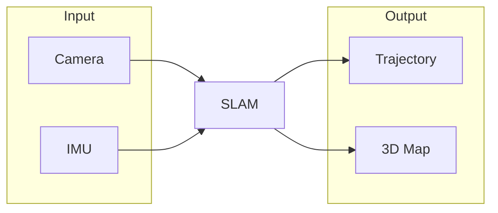
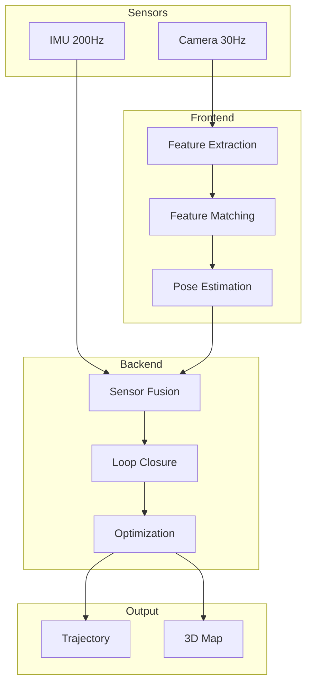
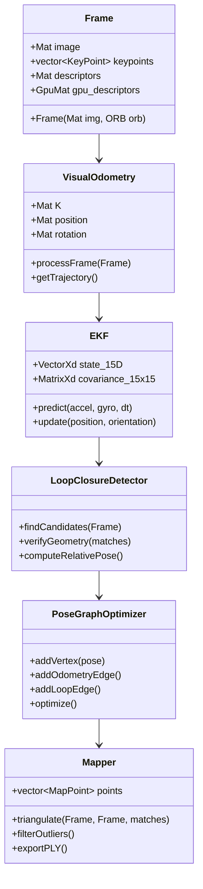
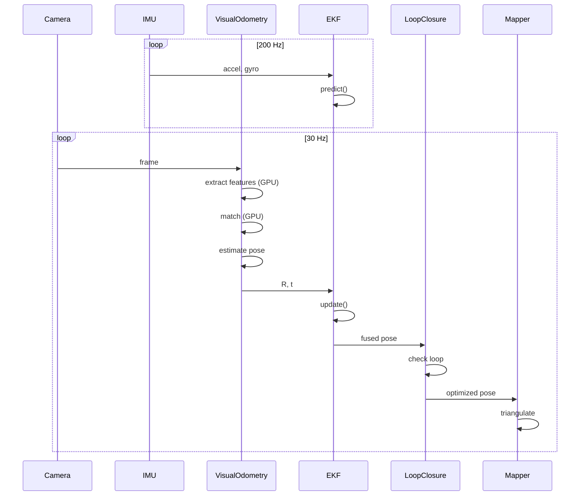
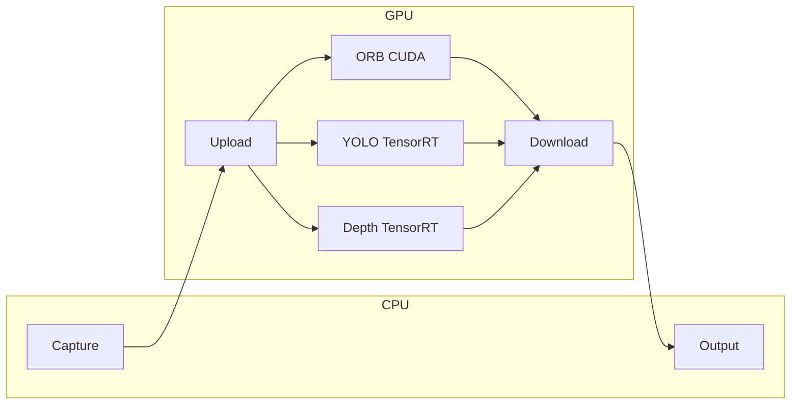
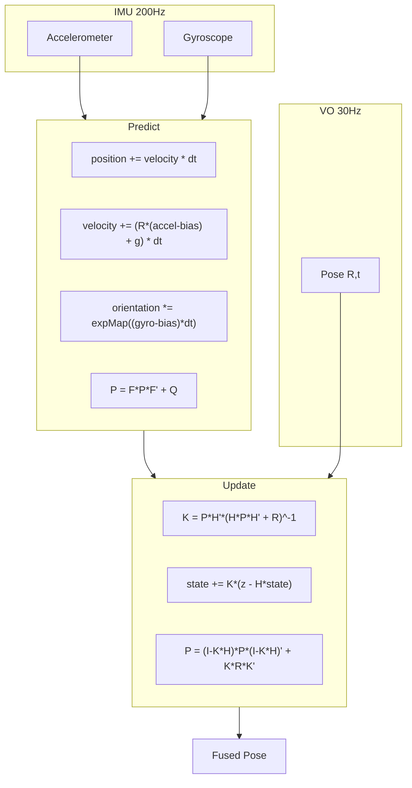
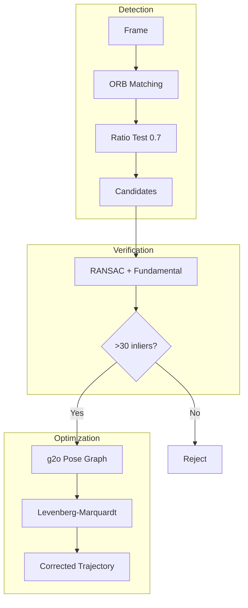
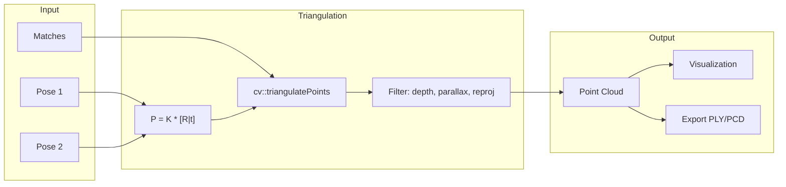

# Aria SLAM

Visual SLAM system in C++ with GPU acceleration (CUDA/TensorRT) for real-time autonomous navigation. Modular implementation including Visual Odometry, feature matching, pose estimation, and deep learning inference support.

---

## Table of Contents

1. [Introduction](#introduction)
2. [Visual SLAM Explained](#visual-slam-explained)
3. [System Architecture](#system-architecture)
4. [Processing Pipeline](#processing-pipeline)
5. [Project Milestones](#project-milestones)
6. [Code Structure](#code-structure)
7. [Dependencies](#dependencies)
8. [Build & Run](#build--run)
9. [References](#references)

---

## Introduction

### What is this project?

Aria SLAM is a from-scratch implementation of a complete SLAM system in C++. The system processes video streams and IMU sensor data to:

- Calculate camera position and orientation in real-time
- Build a 3D map of the environment
- Detect when returning to a previously visited location (loop closure)
- Run deep learning models for detection and depth estimation

### What is it for?

GPS-free autonomous navigation. Drones, robots, AR/VR devices need to know where they are using only their sensors. SLAM analyzes what the camera sees and IMU data to deduce position and build maps.

### Why C++ with CUDA/TensorRT?

Real-time navigation systems require maximum performance. This project demonstrates proficiency in:

- C++ for embedded systems
- CUDA for GPU processing
- TensorRT for deep learning inference
- Sensor fusion for robustness
- Production SLAM architectures

---

## Visual SLAM Explained

### The Problem

Given a sequence of images and IMU data, we want to:
1. Calculate camera position at each instant
2. Build a 3D map of the environment
3. Correct accumulated errors (drift)


```mermaid
flowchart LR
    subgraph Input
        C[Camera]
        I[IMU]
    end

    subgraph Output
        T[Trajectory]
        M[3D Map]
    end

    C --> SLAM
    I --> SLAM
    SLAM --> T
    SLAM --> M
```

### The Solution (Complete Pipeline)


```mermaid
flowchart TD
    subgraph Sensors["Sensors"]
        CAM[Camera 30Hz]
        IMU[IMU 200Hz]
    end

    subgraph Frontend["Frontend"]
        FE[Feature Extraction]
        FM[Feature Matching]
        PE[Pose Estimation]
    end

    subgraph Backend["Backend"]
        SF[Sensor Fusion]
        LC[Loop Closure]
        OPT[Optimization]
    end

    subgraph Output["Output"]
        TRAJ[Trajectory]
        MAP[3D Map]
    end

    CAM --> FE --> FM --> PE
    IMU --> SF
    PE --> SF
    SF --> LC
    LC --> OPT
    OPT --> TRAJ
    OPT --> MAP
```

### Key Components

**1. Feature Extraction (ORB)**
- Detects distinctive points in the image
- Generates descriptors (fingerprint) per point

**2. Feature Matching**
- Finds correspondences between frames
- Ratio test filters false positives

**3. Pose Estimation**
- Essential Matrix relates 2 views
- Recover Pose extracts rotation and translation

**4. Sensor Fusion (Extended Kalman Filter)**
- IMU predicts pose at 200 Hz
- VO corrects drift at 30 Hz
- 15-state vector (position, velocity, orientation, biases)

**5. Loop Closure (g2o)**
- Detects revisited places via ORB matching
- RANSAC geometric verification
- Pose graph optimization corrects drift

**6. Mapping (Triangulation)**
- Converts 2D matches to 3D points
- Filters outliers (depth, parallax, reprojection)
- Exports to PLY/PCD formats

---

## System Architecture

### General Diagram


```mermaid
flowchart TD
    subgraph Hardware["Hardware"]
        ARIA[Aria Glasses]
        GPU[RTX 2060]
    end

    subgraph Capture["Capture"]
        RGB[RGB Camera]
        SLAM_CAM[SLAM Cameras x2]
        IMU_S[IMU Sensor]
    end

    subgraph Processing["Processing"]
        CUDA[OpenCV CUDA]
        TRT[TensorRT]
        CPU[CPU Pipeline]
    end

    subgraph SLAM["SLAM"]
        VO[Visual Odometry]
        FUSION[Sensor Fusion]
        LOOP[Loop Closure]
        MAPPING[3D Mapping]
    end

    subgraph Output["Output"]
        TRAJ[Trajectory]
        MAP[Point Cloud]
        DET[Detections]
    end

    ARIA --> RGB
    ARIA --> SLAM_CAM
    ARIA --> IMU_S

    RGB --> CUDA
    CUDA --> VO
    IMU_S --> FUSION
    VO --> FUSION
    FUSION --> LOOP
    LOOP --> MAPPING

    CUDA --> TRT
    TRT --> DET

    MAPPING --> MAP
    FUSION --> TRAJ
```

### Layer Architecture

```
┌─────────────────────────────────────────┐
│            Application Layer            │
│         (main, ROS node, CLI)           │
├─────────────────────────────────────────┤
│            Pipeline Layer               │
│      (SlamPipeline, orchestration)      │
├─────────────────────────────────────────┤
│           Perception Layer              │
│    (ORB, YOLO, Depth, LoopClosure)      │
├─────────────────────────────────────────┤
│            Fusion Layer                 │
│         (EKF, PoseGraph, g2o)           │
├─────────────────────────────────────────┤
│            Mapping Layer                │
│      (Mapper, PointCloud, Export)       │
├─────────────────────────────────────────┤
│           Hardware Layer                │
│   (Camera, IMU, Aria, EuRoCReader)      │
└─────────────────────────────────────────┘
```

### Class Diagram


```mermaid
classDiagram
    class Frame {
        +Mat image
        +vector~KeyPoint~ keypoints
        +Mat descriptors
        +GpuMat gpu_descriptors
        +Frame(Mat img, ORB orb)
    }

    class VisualOdometry {
        +Mat K
        +Mat position
        +Mat rotation
        +processFrame(Frame)
        +getTrajectory()
    }

    class EKF {
        +VectorXd state_15D
        +MatrixXd covariance_15x15
        +predict(accel, gyro, dt)
        +update(position, orientation)
    }

    class LoopClosureDetector {
        +findCandidates(Frame)
        +verifyGeometry(matches)
        +computeRelativePose()
    }

    class PoseGraphOptimizer {
        +addVertex(pose)
        +addOdometryEdge()
        +addLoopEdge()
        +optimize()
    }

    class Mapper {
        +vector~MapPoint~ points
        +triangulate(Frame, Frame, matches)
        +filterOutliers()
        +exportPLY()
    }

    Frame --> VisualOdometry
    VisualOdometry --> EKF
    EKF --> LoopClosureDetector
    LoopClosureDetector --> PoseGraphOptimizer
    PoseGraphOptimizer --> Mapper
```

### Data Flow


```mermaid
sequenceDiagram
    participant C as Camera
    participant I as IMU
    participant VO as VisualOdometry
    participant SF as EKF
    participant LC as LoopClosure
    participant M as Mapper

    loop 200 Hz
        I->>SF: accel, gyro
        SF->>SF: predict()
    end

    loop 30 Hz
        C->>VO: frame
        VO->>VO: extract features (GPU)
        VO->>VO: match (GPU)
        VO->>VO: estimate pose
        VO->>SF: R, t
        SF->>SF: update()
        SF->>LC: fused pose
        LC->>LC: check loop
        LC->>M: optimized pose
        M->>M: triangulate
    end
```

---

## Processing Pipeline

### GPU Pipeline (H5-H6)


```mermaid
flowchart LR
    subgraph CPU
        CAP[Capture]
        OUT[Output]
    end

    subgraph GPU
        UP[Upload]
        ORB[ORB CUDA]
        YOLO[YOLO TensorRT]
        DEPTH[Depth TensorRT]
        DOWN[Download]
    end

    CAP --> UP
    UP --> ORB --> DOWN
    UP --> YOLO --> DOWN
    UP --> DEPTH --> DOWN
    DOWN --> OUT
```

### Sensor Fusion Pipeline (H8)


```mermaid
flowchart TD
    subgraph IMU["IMU 200Hz"]
        ACC[Accelerometer]
        GYRO[Gyroscope]
    end

    subgraph Predict
        A["position += velocity * dt"]
        B["velocity += (R*(accel-bias) + g) * dt"]
        C["orientation *= expMap((gyro-bias)*dt)"]
        D["P = F*P*F' + Q"]
    end

    subgraph VO["VO 30Hz"]
        POSE[Pose R,t]
    end

    subgraph Update
        E["K = P*H'*(H*P*H' + R)^-1"]
        F["state += K*(z - H*state)"]
        G["P = (I-K*H)*P*(I-K*H)' + K*R*K'"]
    end

    ACC --> Predict
    GYRO --> Predict
    Predict --> Update
    POSE --> Update
    Update --> OUTPUT[Fused Pose]
```

### Loop Closure Pipeline (H9)


```mermaid
flowchart TD
    subgraph Detection
        F[Frame] --> ORB[ORB Matching]
        ORB --> RATIO[Ratio Test 0.7]
        RATIO --> CAND[Candidates]
    end

    subgraph Verification
        CAND --> RANSAC[RANSAC + Fundamental]
        RANSAC --> INLIERS{>30 inliers?}
    end

    subgraph Optimization
        INLIERS -->|Yes| GRAPH[g2o Pose Graph]
        GRAPH --> OPT[Levenberg-Marquardt]
        OPT --> CORRECT[Corrected Trajectory]
    end

    INLIERS -->|No| REJECT[Reject]
```

### Mapping Pipeline (H10)


```mermaid
flowchart LR
    subgraph Input
        M1[Matches]
        P1[Pose 1]
        P2[Pose 2]
    end

    subgraph Triangulation
        PROJ["P = K * [R|t]"]
        TRI[cv::triangulatePoints]
        FILT["Filter: depth, parallax, reproj"]
    end

    subgraph Output
        PC[Point Cloud]
        VIS[Visualization]
        EXP[Export PLY/PCD]
    end

    M1 --> TRI
    P1 --> PROJ --> TRI
    P2 --> PROJ
    TRI --> FILT --> PC
    PC --> VIS
    PC --> EXP
```

---

## Project Milestones

### Phase 1: Core SLAM ✅

| Milestone | Name | Description | Status |
|-----------|------|-------------|--------|
| H1 | Setup + Capture | CMake, OpenCV, video input | ✅ |
| H2 | Feature Extraction | ORB detector, keypoints | ✅ |
| H3 | Feature Matching | BFMatcher, ratio test | ✅ |
| H4 | Pose Estimation | Essential matrix, trajectory | ✅ |
| H5 | OpenCV CUDA | GpuMat, GPU ORB, GPU Matcher, smart pointers | ✅ |
| H6 | TensorRT | YOLOv12s object detection | ✅ |
| H7 | Aria Integration | Aria SDK, sensor capture | ⏳ Hardware |
| H8 | Sensor Fusion | EKF 15-state, IMU + VO fusion | ✅ |
| H9 | Loop Closure | g2o pose graph optimization | ✅ |
| H10 | 3D Mapping | Triangulation, outlier filter, PLY/PCD export | ✅ |

### Phase 2: Optimization ⏳

| Milestone | Name | Description | Status |
|-----------|------|-------------|--------|
| H11 | CUDA Streams | ORB + YOLO parallel GPU, preprocessing on GPU | ⏳ |
| H12 | Multithreading | std::thread, producer/consumer queues, sync | ⏳ |
| H13 | Depth Estimation | DepthAnything/MiDaS TensorRT, dense mapping | ⏳ |
| H14 | Configuration | YAML config, Pangolin 3D visualization | ⏳ |

### Phase 3: Production ⏳

| Milestone | Name | Description | Status |
|-----------|------|-------------|--------|
| H15 | Architecture + Testing | Layer refactor, GoogleTest unit/integration tests | ⏳ |
| H16 | Release | Docker container, README + GIF demo | ⏳ |
| H17 | ROS2 Wrapper | Node pub/sub, sensor_msgs, geometry_msgs | ⏳ |

### Visual Progress


```mermaid
gantt
    title SLAM Progress
    dateFormat X
    axisFormat %s

    section Phase 1 - Core
    H1 Setup           :done, h1, 0, 1
    H2 Features        :done, h2, 1, 2
    H3 Matching        :done, h3, 2, 3
    H4 Pose            :done, h4, 3, 4
    H5 CUDA            :done, h5, 4, 5
    H6 TensorRT        :done, h6, 5, 6
    H8 Fusion          :done, h8, 6, 7
    H9 Loop Closure    :done, h9, 7, 8
    H10 Mapping        :done, h10, 8, 9

    section Phase 2 - Optimization
    H11 CUDA Streams   :h11, 9, 10
    H12 Multithreading :h12, 10, 11
    H13 Depth          :h13, 11, 12
    H14 Config         :h14, 12, 13

    section Phase 3 - Production
    H15 Architecture   :h15, 13, 14
    H16 Release        :h16, 14, 15
    H17 ROS2           :h17, 15, 16

    section Hardware
    H7 Aria            :h7, 16, 17
```

---

## Code Structure

```
aria-slam/
├── CMakeLists.txt
├── README.md
├── config.yaml                # Configuration (H14)
├── Dockerfile                 # Container (H16)
├── include/
│   ├── hardware/              # H15 refactor
│   │   ├── Camera.hpp
│   │   ├── IMUSensor.hpp
│   │   └── EuRoCReader.hpp
│   ├── perception/
│   │   ├── ORBExtractor.hpp
│   │   ├── FeatureMatcher.hpp
│   │   ├── YOLODetector.hpp
│   │   └── LoopDetector.hpp
│   ├── fusion/
│   │   ├── EKF.hpp
│   │   └── PoseGraph.hpp
│   ├── mapping/
│   │   ├── Triangulator.hpp
│   │   └── MapExporter.hpp
│   └── pipeline/
│       └── SlamPipeline.hpp
├── src/
│   ├── main.cpp               # Main SLAM pipeline
│   ├── euroc_eval.cpp         # EuRoC dataset evaluation
│   └── ...                    # Implementations
├── tests/                     # H15 testing
│   ├── unit/
│   │   ├── test_ekf.cpp
│   │   ├── test_orb.cpp
│   │   └── test_triangulation.cpp
│   └── integration/
│       └── test_pipeline.cpp
├── datasets/
│   └── MH_01_easy/            # EuRoC sequences
├── models/
│   └── yolov12s.engine        # YOLOv12s TensorRT engine
└── build/
```

---

## Dependencies

### Requirements

| Dependency | Version | Purpose |
|------------|---------|---------|
| CMake | >= 3.16 | Build system |
| GCC/Clang | C++17 | Compiler |
| OpenCV | >= 4.6 + CUDA | Computer vision |
| CUDA Toolkit | >= 12.0 | GPU computing |
| TensorRT | >= 10.0 | Deep learning inference |
| Eigen | >= 3.3 | Linear algebra |
| g2o | - | Graph optimization |
| yaml-cpp | - | Configuration (H14) |
| Pangolin | - | 3D visualization (H14) |
| GTest | - | Testing (H15) |
| ROS2 Humble | - | Robot integration (H17) |

### Ubuntu Installation

```bash
# Basics
sudo apt update
sudo apt install cmake g++ gcc-12 g++-12 libopencv-dev

# CUDA Toolkit (use /home as tmp if / is full)
export TMPDIR=/home/$USER/tmp && mkdir -p $TMPDIR
sudo apt install nvidia-cuda-toolkit

# Eigen
sudo apt install libeigen3-dev

# g2o
sudo apt install libg2o-dev

# yaml-cpp
sudo apt install libyaml-cpp-dev

# GoogleTest
sudo apt install libgtest-dev
```

### OpenCV with CUDA (Compilation)

OpenCV from apt doesn't include CUDA support. Must be compiled:

```bash
# Clone OpenCV 4.9.0
cd ~/libs
git clone --depth 1 --branch 4.9.0 https://github.com/opencv/opencv.git
git clone --depth 1 --branch 4.9.0 https://github.com/opencv/opencv_contrib.git

# Configure (use GCC-12 for CUDA compatibility)
mkdir -p opencv/build && cd opencv/build
cmake .. \
    -DCMAKE_C_COMPILER=/usr/bin/gcc-12 \
    -DCMAKE_CXX_COMPILER=/usr/bin/g++-12 \
    -DCMAKE_BUILD_TYPE=Release \
    -DCMAKE_INSTALL_PREFIX=~/libs/opencv_cuda \
    -DWITH_CUDA=ON \
    -DWITH_CUDNN=OFF \
    -DENABLE_FAST_MATH=ON \
    -DCUDA_FAST_MATH=ON \
    -DWITH_CUBLAS=ON \
    -DCUDA_ARCH_BIN=7.5 \
    -DOPENCV_EXTRA_MODULES_PATH=~/libs/opencv_contrib/modules \
    -DBUILD_EXAMPLES=OFF \
    -DBUILD_TESTS=OFF

# Compile and install (~20-30 min)
make -j8 && make install

# Add to ~/.zshrc or ~/.bashrc
export OpenCV_DIR=~/libs/opencv_cuda
```

> **Note:** Change `CUDA_ARCH_BIN=7.5` according to your GPU:
> - RTX 2060/2070/2080: 7.5
> - RTX 3060/3070/3080: 8.6
> - RTX 4060/4070/4080: 8.9
> - RTX 5070/5080/5090: 10.0

### TensorRT (Installation)

```bash
# Download TensorRT 10.x from NVIDIA (requires account)
# https://developer.nvidia.com/tensorrt/download

# Extract
cd ~/libs
tar -xzf TensorRT-10.7.0.23.Linux.x86_64-gnu.cuda-12.6.tar.gz

# Add to ~/.zshrc or ~/.bashrc
export LD_LIBRARY_PATH=~/libs/TensorRT-10.7.0.23/lib:$LD_LIBRARY_PATH
export PATH=~/libs/TensorRT-10.7.0.23/bin:$PATH

# Convert YOLO model to TensorRT engine
trtexec --onnx=models/yolov12s.onnx --saveEngine=models/yolov12s.engine --fp16
```

### Verify Installation

```bash
nvcc --version          # CUDA compiler
nvidia-smi              # GPU status
pkg-config --modversion opencv4
pkg-config --modversion eigen3
```

---

## Build & Run

### Compile

```bash
mkdir -p build && cd build
cmake ..
make -j$(nproc)
```

### Run

```bash
./aria_slam
```

### Run Tests (H15)

```bash
cd build
ctest --output-on-failure
# or
./run_tests
```

### Evaluate on EuRoC Dataset

Download [EuRoC MAV Dataset](https://projects.asl.ethz.ch/datasets/) and run:

```bash
# Download dataset
cd datasets
wget https://www.research-collection.ethz.ch/bitstreams/.../download -O machine_hall.zip
unzip machine_hall.zip

# Run evaluation
./euroc_eval ../datasets/MH_01_easy
```

Output includes:
- **ATE (Absolute Trajectory Error)**: RMSE of position error in meters
- **RPE (Relative Pose Error)**: RMSE of relative motion error
- Trajectory visualization (estimated vs ground truth)
- Point cloud map (PLY format)

### Docker (H16)

```bash
# Build
docker build -t aria-slam .

# Run
docker run --gpus all -v /dev/video0:/dev/video0 aria-slam
```

### ROS2 (H17)

```bash
# Build
cd ~/ros2_ws
colcon build --packages-select aria_slam_ros

# Run
ros2 launch aria_slam_ros slam.launch.py

# Visualize
ros2 run rviz2 rviz2
```

### SSH with X11

```bash
ssh -Y user@host
export LIBGL_ALWAYS_SOFTWARE=1
./aria_slam
```

---

## Performance

| Metric | Value |
|--------|-------|
| FPS | 150+ (GPU pipeline) |
| GPU Usage | ~200MB VRAM |
| YOLO Inference | ~5ms |
| ORB Extraction | ~10ms (GPU) |

---

## References

### Papers
- [ORB-SLAM2](https://arxiv.org/abs/1610.06475)
- [VINS-Mono](https://arxiv.org/abs/1708.03852)
- [g2o: A General Framework for Graph Optimization](http://ais.informatik.uni-freiburg.de/publications/papers/kuemmerle11icra.pdf)

### Documentation
- [OpenCV CUDA](https://docs.opencv.org/4.x/d2/dbc/cuda_intro.html)
- [TensorRT Developer Guide](https://docs.nvidia.com/deeplearning/tensorrt/developer-guide/)
- [Eigen Quick Reference](https://eigen.tuxfamily.org/dox/group__QuickRefPage.html)
- [g2o Tutorial](https://github.com/RainerKuemmerle/g2o)
- [ROS2 Humble](https://docs.ros.org/en/humble/)

### Resources
- [Meta Aria Project](https://www.projectaria.com/)
- [Multiple View Geometry Book](https://www.robots.ox.ac.uk/~vgg/hzbook/)
- [EuRoC MAV Dataset](https://projects.asl.ethz.ch/datasets/doku.php?id=kmavvisualinertialdatasets)

---

## Author

Developed as a learning project for C++, CUDA, and SLAM systems.

## License

MIT