# Aria SLAM

Visual-Inertial SLAM system in C++ with GPU acceleration (CUDA/TensorRT) designed for **Meta Aria glasses**. The goal is to enable **real-time navigation assistance for visually impaired users** through spatial audio feedback and scene understanding.

The architecture is inspired by professional UAV navigation systems (DJI, PX4) and state-of-the-art SLAM implementations (ORB-SLAM2, VINS-Mono), adapting their proven techniques for wearable devices. The system combines classical computer vision (ORB features, EKF sensor fusion, g2o optimization) with modern deep learning (YOLO object detection, depth estimation, VLM scene understanding) to build a complete perception pipeline that runs in real-time (30 FPS) on embedded GPUs.

**Key features:**
- **Visual Odometry:** ORB-CUDA feature extraction and matching
- **Sensor Fusion:** 15-state EKF combining IMU (200Hz) + VO (30Hz)
- **Loop Closure:** g2o pose graph optimization with RANSAC verification
- **3D Mapping:** Triangulation with outlier filtering, PLY/PCD export
- **Object Detection:** YOLOv12s via TensorRT (~5ms inference)
- **VLM Integration:** Scene understanding via [aria-scene](https://github.com/robertteleng/aria-scene) (FastVLM + FastViT)
- **Obstacle Avoidance:** Depth-based alerts with spatial audio (planned)

---

## Table of Contents

1. [Introduction](#introduction)
2. [Visual SLAM Explained](#visual-slam-explained)
3. [System Architecture](#system-architecture)
4. [Processing Pipeline](#processing-pipeline)
5. [Project Milestones](#project-milestones)
6. [Code Structure](#code-structure)
7. [Dependencies](#dependencies)
8. [Build & Run](#build--run)
9. [Glossary](#glossary)
10. [References](#references)

---

## Introduction

### What is this project?

Aria SLAM is a from-scratch implementation of a complete SLAM system in C++. The system processes video streams and IMU sensor data to:

- Calculate camera position and orientation in real-time
- Build a 3D map of the environment
- Detect when returning to a previously visited location (loop closure)
- Run deep learning models for detection and depth estimation

### What is it for?

GPS-free autonomous navigation. Drones, robots, AR/VR devices need to know where they are using only their sensors. SLAM analyzes what the camera sees and IMU data to deduce position and build maps.

### Why C++ with CUDA/TensorRT?

Real-time navigation systems require maximum performance. This project demonstrates proficiency in:

- C++ for embedded systems
- CUDA for GPU processing
- TensorRT for deep learning inference
- Sensor fusion for robustness
- Production SLAM architectures

---

## Visual SLAM Explained

### The Problem

Given a sequence of images and IMU data, we want to:
1. Calculate camera position at each instant
2. Build a 3D map of the environment
3. Correct accumulated errors (drift)


### The Solution (Complete Pipeline)


### Key Components

**1. Feature Extraction (ORB)**
- Detects distinctive points in the image
- Generates descriptors (fingerprint) per point

**2. Feature Matching**
- Finds correspondences between frames
- Ratio test filters false positives

**3. Pose Estimation**
- Essential Matrix relates 2 views
- Recover Pose extracts rotation and translation

**4. Sensor Fusion (Extended Kalman Filter)**
- IMU predicts pose at 200 Hz
- VO corrects drift at 30 Hz
- 15-state vector (position, velocity, orientation, biases)

**5. Loop Closure (g2o)**
- Detects revisited places via ORB matching
- RANSAC geometric verification
- Pose graph optimization corrects drift

**6. Mapping (Triangulation)**
- Converts 2D matches to 3D points
- Filters outliers (depth, parallax, reprojection)
- Exports to PLY/PCD formats

---

## System Architecture

### General Diagram


### Layer Architecture


### Class Diagram


### Data Flow


---

## Processing Pipeline

**Subsections:**
- [GPU Pipeline (H5-H6)](#gpu-pipeline-h5-h6)
- [Sensor Fusion Pipeline (H8)](#sensor-fusion-pipeline-h8)
- [Loop Closure Pipeline (H9)](#loop-closure-pipeline-h9)
- [Mapping Pipeline (H10)](#mapping-pipeline-h10)
- [CUDA Streams (H11)](#cuda-streams-h11)
- [VLM Integration (H23)](#vlm-integration-h23)

### GPU Pipeline (H5-H6)


### Sensor Fusion Pipeline (H8)


### Loop Closure Pipeline (H9)


### Mapping Pipeline (H10)


### CUDA Streams (H11) ✅

**Problem:** Sequential GPU execution wastes resources. While ORB computes, YOLO waits idle.

```
Sequential:
|--ORB 10ms--|--YOLO 5ms--| = 15ms total (67 FPS)

Parallel (with streams):
|--ORB 10ms---------|
|--YOLO 5ms--|
= 10ms total (100 FPS theoretical)
```

**Solution:** CUDA Streams allow independent GPU operations to run concurrently on different SM (Streaming Multiprocessors).


**Implementation (actual code):**
```cpp
// Create streams (main.cpp:74-77)
cudaStream_t stream_orb, stream_yolo;
cudaStreamCreate(&stream_orb);
cudaStreamCreate(&stream_yolo);

// Launch parallel (main.cpp:103-110)
Frame current_frame(frame, orb, stream_orb);  // Async ORB
yolo->detectAsync(frame, stream_yolo);         // Async YOLO

// Synchronize (main.cpp:112-114)
cudaStreamSynchronize(stream_orb);
cudaStreamSynchronize(stream_yolo);

// Get results (main.cpp:116-123)
current_frame.downloadResults();
auto detections = yolo->getDetections(0.5f, 0.45f);
```

**Key techniques:**
- `cv::cuda::StreamAccessor::wrapStream()` - Convert cudaStream_t to cv::cuda::Stream
- `detectAndComputeAsync()` - Non-blocking ORB on GPU
- `enqueueV3()` - TensorRT async inference
- Lazy download pattern with `downloadResults()`

**Benchmark results:**
| Metric | Sequential | Parallel | Improvement |
|--------|------------|----------|-------------|
| Latency | 13.7 ms | 12.5 ms | -9% |
| FPS | 73 | 80 | +10% |

> See [docs/H11_CUDA_STREAMS_AUDIT.md](docs/H11_CUDA_STREAMS_AUDIT.md) for detailed technical analysis and C++ vs Python comparison.

### VLM Integration (H23)

**Goal:** Add scene understanding via Vision Language Models without compromising real-time SLAM performance.

**Architecture:** Separate C++ core (critical path) from Python VLM (non-critical) via ROS2 topics.


**Hybrid Routing:** aria-scene uses intelligent routing between models:
- **FastViT** (~15ms): Fast classification for simple scenes (70%)
- **FastVLM** (~400ms): Detailed VLM for complex scenes (30%)
- **Average latency:** ~200ms with hybrid routing

**Why this architecture?**
- **Decoupled:** VLM lag doesn't block SLAM (30+ FPS maintained)
- **Flexible:** Can swap VLM models without recompiling C++
- **Scalable:** VLM can run on separate GPU or even remote server
- **Voice Control:** "describe", "fast mode", "detailed mode" commands

**Related project:** [aria-scene](https://github.com/robertteleng/aria-scene) - Python VLM module with FastVLM + FastViT hybrid engine

---

## Project Milestones

### Phase 1: Core SLAM ✅

| Milestone | Name | Description | Status |
|-----------|------|-------------|--------|
| H1 | Setup + Capture | CMake, OpenCV, video input | ✅ |
| H2 | Feature Extraction | ORB detector, keypoints | ✅ |
| H3 | Feature Matching | BFMatcher, ratio test | ✅ |
| H4 | Pose Estimation | Essential matrix, trajectory | ✅ |
| H5 | OpenCV CUDA | GpuMat, GPU ORB, GPU Matcher, smart pointers | ✅ |
| H6 | TensorRT | YOLOv12s object detection | ✅ |
| H7 | Aria Integration | Aria SDK, sensor capture | ⏳ Hardware |
| H8 | Sensor Fusion | EKF 15-state, IMU + VO fusion | ✅ |
| H9 | Loop Closure | g2o pose graph optimization | ✅ |
| H10 | 3D Mapping | Triangulation, outlier filter, PLY/PCD export | ✅ |

### Phase 2: Optimization ⏳

| Milestone | Name | Description | Status |
|-----------|------|-------------|--------|
| H11 | CUDA Streams | ORB + YOLO parallel GPU execution | ✅ |
| H12 | Multithreading | std::thread, producer/consumer queues | ⏳ |
| H13 | Depth Estimation | DepthAnything/MiDaS TensorRT, dense mapping | ⏳ |
| H14 | Configuration | YAML config file for parameters | ⏳ |

### Phase 3: Advanced Features ⏳

| Milestone | Name | Description | Status |
|-----------|------|-------------|--------|
| H15 | Keyframe Selection | Intelligent keyframe selection for mapping/loop closure | ⏳ |
| H16 | Stereo Vision | Stereo matching GPU, disparity → depth | ⏳ |
| H17 | Path Planning | A*/RRT* navigation on 3D map | ⏳ |
| H18 | Pangolin Visualization | 3D real-time trajectory and map viewer | ⏳ |
| H19 | Obstacle Avoidance | Depth-based alerts with spatial audio feedback | ⏳ |

### Phase 4: Production ⏳

| Milestone | Name | Description | Status |
|-----------|------|-------------|--------|
| H20 | Architecture + Testing | Layer refactor, GoogleTest unit/integration tests | ⏳ |
| H21 | Docker + Release | Docker container, README + GIF demo | ⏳ |
| H22 | ROS2 Wrapper | Node pub/sub, sensor_msgs, geometry_msgs | ⏳ |
| H23 | VLM Integration | FastVLM scene understanding via ROS2 topics | ⏳ |

### Visual Progress

```mermaid
gantt
    title SLAM Progress
    dateFormat X
    axisFormat %s

    section Phase 1 - Core
    H1 Setup           :done, h1, 0, 1
    H2 Features        :done, h2, 1, 2
    H3 Matching        :done, h3, 2, 3
    H4 Pose            :done, h4, 3, 4
    H5 CUDA            :done, h5, 4, 5
    H6 TensorRT        :done, h6, 5, 6
    H8 Fusion          :done, h8, 6, 7
    H9 Loop Closure    :done, h9, 7, 8
    H10 Mapping        :done, h10, 8, 9

    section Phase 2 - Optimization
    H11 CUDA Streams   :done, h11, 9, 10
    H12 Multithreading :h12, 10, 11
    H13 Depth          :h13, 11, 12
    H14 Config         :h14, 12, 13

    section Phase 3 - Advanced
    H15 Keyframes      :h15, 13, 14
    H16 Stereo         :h16, 14, 15
    H17 Path Planning  :h17, 15, 16
    H18 Pangolin       :h18, 16, 17
    H19 Obstacle       :h19, 17, 18

    section Phase 4 - Production
    H20 Architecture   :h20, 18, 19
    H21 Docker         :h21, 19, 20
    H22 ROS2           :h22, 20, 21
    H23 VLM            :h23, 21, 22

    section Hardware
    H7 Aria            :h7, 21, 22
```



---

## Code Structure

### Current Structure

```
aria-slam/
├── CMakeLists.txt
├── README.md
├── include/
│   ├── Frame.hpp              # Frame with GPU descriptors
│   ├── TRTInference.hpp       # TensorRT YOLO inference
│   ├── SensorFusion.hpp       # EKF 15-state fusion
│   ├── LoopClosureDetector.hpp # Loop detection + g2o
│   ├── PoseGraphOptimizer.hpp # g2o pose graph
│   ├── Mapper.hpp             # 3D triangulation
│   └── EuRoCReader.hpp        # Dataset reader
├── src/
│   ├── main.cpp               # Main SLAM pipeline
│   ├── euroc_eval.cpp         # EuRoC benchmark
│   ├── TRTInference.cpp       # TensorRT implementation
│   ├── SensorFusion.cpp       # EKF implementation
│   ├── LoopClosureDetector.cpp
│   ├── PoseGraphOptimizer.cpp
│   ├── Mapper.cpp
│   └── EuRoCReader.cpp
├── datasets/
│   └── MH_01_easy/            # EuRoC sequences
├── models/
│   └── yolov12s.engine        # YOLOv12s TensorRT engine
└── build/
```

### Future Structure (H19 Refactor)

```
aria-slam/
├── CMakeLists.txt
├── README.md
├── config.yaml                # Configuration (H14)
├── Dockerfile                 # Container (H20)
├── include/
│   ├── hardware/
│   │   ├── Camera.hpp
│   │   ├── IMUSensor.hpp
│   │   └── EuRoCReader.hpp
│   ├── perception/
│   │   ├── ORBExtractor.hpp
│   │   ├── FeatureMatcher.hpp
│   │   ├── YOLODetector.hpp
│   │   └── LoopDetector.hpp
│   ├── fusion/
│   │   ├── EKF.hpp
│   │   └── PoseGraph.hpp
│   ├── mapping/
│   │   ├── Triangulator.hpp
│   │   └── MapExporter.hpp
│   └── pipeline/
│       └── SlamPipeline.hpp
├── src/
│   └── ...
├── tests/                     # H19 testing
│   ├── unit/
│   │   ├── test_ekf.cpp
│   │   ├── test_orb.cpp
│   │   └── test_triangulation.cpp
│   └── integration/
│       └── test_pipeline.cpp
├── datasets/
├── models/
└── build/
```

---

## Dependencies

### Requirements

| Dependency | Version | Purpose |
|------------|---------|---------|
| CMake | >= 3.16 | Build system |
| GCC/Clang | C++17 | Compiler |
| OpenCV | >= 4.6 + CUDA | Computer vision |
| CUDA Toolkit | >= 12.0 | GPU computing |
| TensorRT | >= 10.0 | Deep learning inference |
| Eigen | >= 3.3 | Linear algebra |
| g2o | - | Graph optimization |
| yaml-cpp | - | Configuration (H14) |
| Pangolin | - | 3D visualization (H17) |
| GTest | - | Testing (H19) |
| ROS2 Humble | - | Robot integration (H21) |

### Ubuntu Installation

```bash
# Basics
sudo apt update
sudo apt install cmake g++ gcc-12 g++-12 libopencv-dev

# CUDA Toolkit (use /home as tmp if / is full)
export TMPDIR=/home/$USER/tmp && mkdir -p $TMPDIR
sudo apt install nvidia-cuda-toolkit

# Eigen
sudo apt install libeigen3-dev

# g2o
sudo apt install libg2o-dev

# yaml-cpp
sudo apt install libyaml-cpp-dev

# GoogleTest
sudo apt install libgtest-dev
```

### OpenCV with CUDA (Compilation)

OpenCV from apt doesn't include CUDA support. Must be compiled:

```bash
# Clone OpenCV 4.9.0
cd ~/libs
git clone --depth 1 --branch 4.9.0 https://github.com/opencv/opencv.git
git clone --depth 1 --branch 4.9.0 https://github.com/opencv/opencv_contrib.git

# Configure (use GCC-12 for CUDA compatibility)
mkdir -p opencv/build && cd opencv/build
cmake .. \
    -DCMAKE_C_COMPILER=/usr/bin/gcc-12 \
    -DCMAKE_CXX_COMPILER=/usr/bin/g++-12 \
    -DCMAKE_BUILD_TYPE=Release \
    -DCMAKE_INSTALL_PREFIX=~/libs/opencv_cuda \
    -DWITH_CUDA=ON \
    -DWITH_CUDNN=OFF \
    -DENABLE_FAST_MATH=ON \
    -DCUDA_FAST_MATH=ON \
    -DWITH_CUBLAS=ON \
    -DCUDA_ARCH_BIN=7.5 \
    -DOPENCV_EXTRA_MODULES_PATH=~/libs/opencv_contrib/modules \
    -DBUILD_EXAMPLES=OFF \
    -DBUILD_TESTS=OFF

# Compile and install (~20-30 min)
make -j8 && make install

# Add to ~/.zshrc or ~/.bashrc
export OpenCV_DIR=~/libs/opencv_cuda
```

> **Note:** Change `CUDA_ARCH_BIN=7.5` according to your GPU:
> - RTX 2060/2070/2080: 7.5
> - RTX 3060/3070/3080: 8.6
> - RTX 4060/4070/4080: 8.9
> - RTX 5070/5080/5090: 10.0

### TensorRT (Installation)

```bash
# Download TensorRT 10.x from NVIDIA (requires account)
# https://developer.nvidia.com/tensorrt/download

# Extract
cd ~/libs
tar -xzf TensorRT-10.7.0.23.Linux.x86_64-gnu.cuda-12.6.tar.gz

# Add to ~/.zshrc or ~/.bashrc
export LD_LIBRARY_PATH=~/libs/TensorRT-10.7.0.23/lib:$LD_LIBRARY_PATH
export PATH=~/libs/TensorRT-10.7.0.23/bin:$PATH

# Convert YOLO model to TensorRT engine
trtexec --onnx=models/yolov12s.onnx --saveEngine=models/yolov12s.engine --fp16
```

### Verify Installation

```bash
nvcc --version          # CUDA compiler
nvidia-smi              # GPU status
pkg-config --modversion opencv4
pkg-config --modversion eigen3
```

---

## Build & Run

### Compile

```bash
mkdir -p build && cd build
cmake ..
make -j$(nproc)
```

### Run

```bash
./aria_slam
```

### Run Tests (H19)

```bash
cd build
ctest --output-on-failure
# or
./run_tests
```

### Evaluate on EuRoC Dataset

Download [EuRoC MAV Dataset](https://projects.asl.ethz.ch/datasets/) and run:

```bash
# Download dataset
cd datasets
wget https://www.research-collection.ethz.ch/bitstreams/.../download -O machine_hall.zip
unzip machine_hall.zip

# Run evaluation
./euroc_eval ../datasets/MH_01_easy
```

Output includes:
- **ATE (Absolute Trajectory Error)**: RMSE of position error in meters
- **RPE (Relative Pose Error)**: RMSE of relative motion error
- Trajectory visualization (estimated vs ground truth)
- Point cloud map (PLY format)

### Docker (H20)

```bash
# Build
docker build -t aria-slam .

# Run
docker run --gpus all -v /dev/video0:/dev/video0 aria-slam
```

### ROS2 (H21)

```bash
# Build
cd ~/ros2_ws
colcon build --packages-select aria_slam_ros

# Run
ros2 launch aria_slam_ros slam.launch.py

# Visualize
ros2 run rviz2 rviz2
```

### SSH with X11

```bash
ssh -Y user@host
export LIBGL_ALWAYS_SOFTWARE=1
./aria_slam
```

---

## Performance

| Metric | Value | Notes |
|--------|-------|-------|
| FPS (ORB only) | 150+ | GPU pipeline without inference |
| FPS (ORB + YOLO sequential) | ~73 | Before H11 |
| FPS (ORB + YOLO parallel) | ~80 | After H11 CUDA Streams (+10%) |
| GPU Usage | ~500MB VRAM | ORB + YOLO |
| YOLO Inference | ~5ms | YOLOv12s TensorRT FP16 |
| ORB Extraction | ~10ms | GPU accelerated |
| EKF Update | <1ms | 15-state fusion |

---

## Glossary

### Acronyms

| Acronym | Full Name | Description |
|---------|-----------|-------------|
| **SLAM** | Simultaneous Localization and Mapping | Building a map while tracking position |
| **VO** | Visual Odometry | Estimating motion from camera images |
| **VIO** | Visual-Inertial Odometry | VO combined with IMU data |
| **IMU** | Inertial Measurement Unit | Accelerometer + gyroscope sensor |
| **EKF** | Extended Kalman Filter | Nonlinear state estimation algorithm |
| **ORB** | Oriented FAST and Rotated BRIEF | Feature detector + descriptor |
| **RANSAC** | Random Sample Consensus | Robust estimation with outliers |
| **ATE** | Absolute Trajectory Error | Global position accuracy metric |
| **RPE** | Relative Pose Error | Local motion accuracy metric |
| **DoF** | Degrees of Freedom | Number of independent motions (6DoF = 3 translation + 3 rotation) |
| **FPS** | Frames Per Second | Processing speed |
| **GPU** | Graphics Processing Unit | Parallel processor for acceleration |
| **CUDA** | Compute Unified Device Architecture | NVIDIA GPU programming platform |
| **TRT** | TensorRT | NVIDIA deep learning inference optimizer |
| **ROS** | Robot Operating System | Robotics middleware framework |
| **PLY** | Polygon File Format | 3D point cloud format |
| **PCD** | Point Cloud Data | PCL native point cloud format |
| **VLM** | Vision Language Model | AI model that understands images + text |
| **TTS** | Text-to-Speech | Audio output from text |
| **SM** | Streaming Multiprocessor | GPU processing unit for CUDA streams |

### Technical Terms

| Term | Description |
|------|-------------|
| **Keypoint** | Distinctive point in image (corner, blob) |
| **Descriptor** | Binary/float vector describing a keypoint |
| **Feature matching** | Finding corresponding keypoints between images |
| **Essential matrix** | Relates two calibrated camera views (encodes R, t) |
| **Fundamental matrix** | Relates two uncalibrated views |
| **Triangulation** | Computing 3D point from 2+ 2D observations |
| **Loop closure** | Detecting revisited locations to correct drift |
| **Pose graph** | Graph where nodes=poses, edges=constraints |
| **Bundle adjustment** | Joint optimization of poses and 3D points |
| **Drift** | Accumulated error over time |
| **Keyframe** | Selected frame stored for mapping/loop closure |
| **Covisibility** | Frames that observe same map points |
| **Preintegration** | Combining multiple IMU measurements between frames |
| **Marginalization** | Removing old states while preserving information |
| **CUDA Stream** | Queue of GPU operations that execute in order |
| **Async inference** | Non-blocking GPU execution |
| **Hybrid routing** | Choosing between fast/detailed models based on scene complexity |

---

## References

### Papers
- [ORB-SLAM2](https://arxiv.org/abs/1610.06475)
- [VINS-Mono](https://arxiv.org/abs/1708.03852)
- [g2o: A General Framework for Graph Optimization](http://ais.informatik.uni-freiburg.de/publications/papers/kuemmerle11icra.pdf)

### Documentation
- [OpenCV CUDA](https://docs.opencv.org/4.x/d2/dbc/cuda_intro.html)
- [TensorRT Developer Guide](https://docs.nvidia.com/deeplearning/tensorrt/developer-guide/)
- [Eigen Quick Reference](https://eigen.tuxfamily.org/dox/group__QuickRefPage.html)
- [g2o Tutorial](https://github.com/RainerKuemmerle/g2o)
- [ROS2 Humble](https://docs.ros.org/en/humble/)

### Resources
- [Meta Aria Project](https://www.projectaria.com/)
- [Multiple View Geometry Book](https://www.robots.ox.ac.uk/~vgg/hzbook/)
- [EuRoC MAV Dataset](https://projects.asl.ethz.ch/datasets/doku.php?id=kmavvisualinertialdatasets)

---

## Author

Developed as a learning project for C++, CUDA, and SLAM systems.

## License

MIT